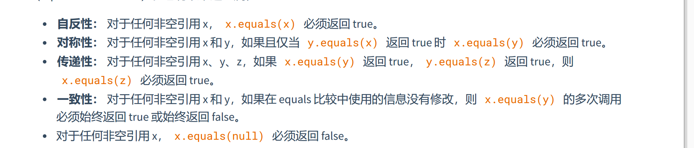

# effective Java 第一讲

1. 使用静态方法代替构造方法
   1. 优点:
      1. 静态方法有名字，便于区分，构造函数如果只有参数顺序不同将会是噩梦
      2. 静态方法可以不必每次都创建一个对象，尤其是对于不需要每次都创建的情况
      3. 可以返回子类
      4. 可以根据入参返回不同的子类
      5. 返回的对象的类可以不存在
   2. 缺点
      1. 没有公共方法或者protected的方法不能被继承
      2. 不方便找到，
2. 当构造函数参数过多的时候使用builder模式
3. 使用私有构造方法或者枚举类实现单例模式 
4. 使用私有构造方法让类不可以被实例化
5. 使用依赖注入取代硬链接资源
6. 避免创建不必要的对象
7. 消除过期对象的引用，一般存在于一个类有自己管理的内存的情况，对自己不需要的对象应该及时释放。就是清空对象，这 应该是例外，而不是规范。正确的方式应该是超过作用域自动消失。另外一个内存泄露的可能是缓存。 可以使用弱引用map来解决
8. 避免使用finalizer和cleaner机制
   1. 首先这两个机制是不能确定触发时机的
   2. 不是很好预知的。
   3. finalizer的机制还有问题就是没有被捕获的异常会被忽略，并且该对象的finalizer机制会停止。
      
      
9. 使用try -with-source 代替try catch finally 里面的资源必须要实现autoCloseable接口
10. 重写equals方法时遵循通用约定，满足一下的条件都可以不重写
   当需要一个逻辑相等而且父类没有重写过equals方法的时候，需要一个新的equals方法，而且需要遵循一下约定
11. 重写equals必须重写hashcode方法
12. 始终重写toString方法
13. 谨慎重写clone方法
14. 考虑实现compareable接口
15. 对象的成员属性可访问性最小化
16. 公共类使用方法而不是属性，尤其是可变属性，不可变属性问题会小一些
17. 最小化可变性
18. 组合优先于继承
    1. 与方法调用不同，继承是打破封装的，因为父类的属性可以被子类访问。
19. 