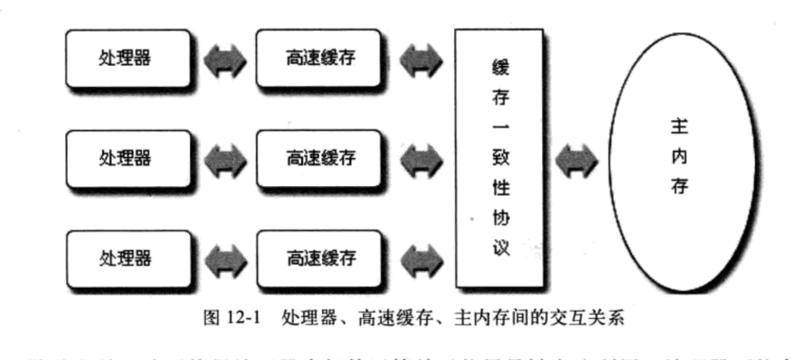
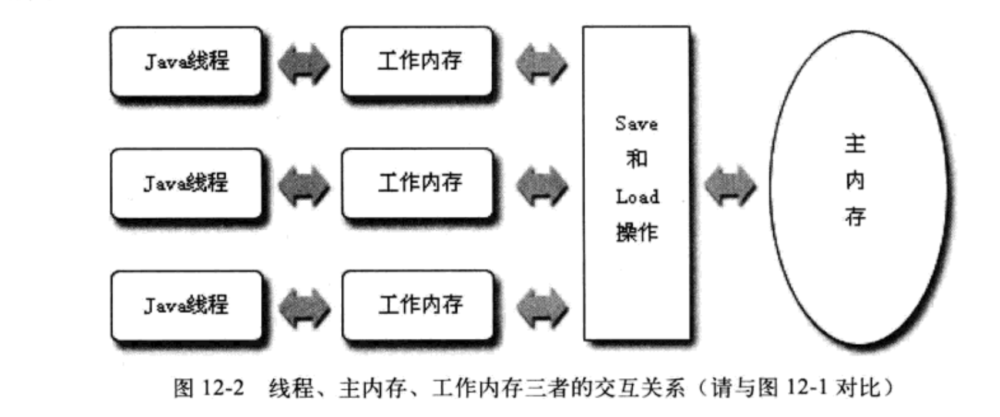
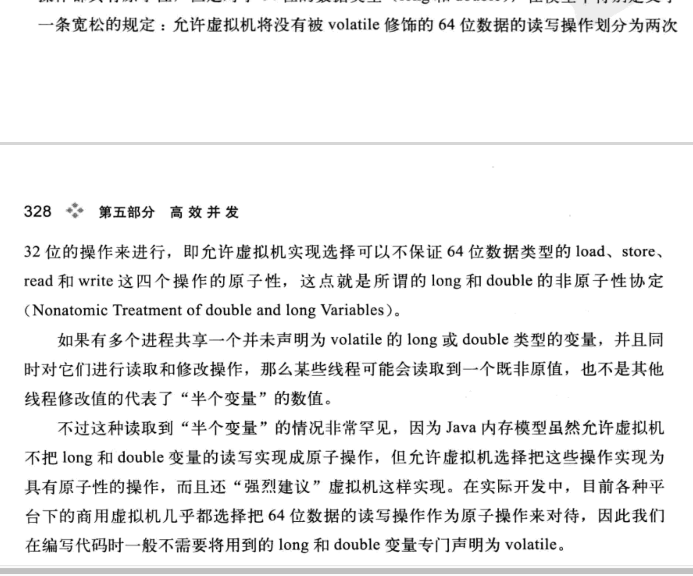

# Java 内存模型

1. 内存模型的基本状况

2. volatile 第一个是**保证变量对所有线程的可见性**。(当一个线程修改了这个变量其他的线程会立刻得知)
       volatile只保证可见性。所以如果不满足以下两点的情况仍然需要加锁。

   1. 运算结果不依赖当前值，或者能够保证只有一个线程修改变量
   2. 变量不需要与其他状态的变量共同参与不变约束

   volatile的第二个保证是**禁止指令重排序优化**指令重排序的保证是在线程内像是串行的。

3. volatile 读操作和普通变量基本没有区别，但是写操作会慢一点，因为需要插入内存屏障。和锁还有synchronized比还是快，但是锁和synchronized有虚拟机的优化，很难说比volatile慢多少。

4. 

