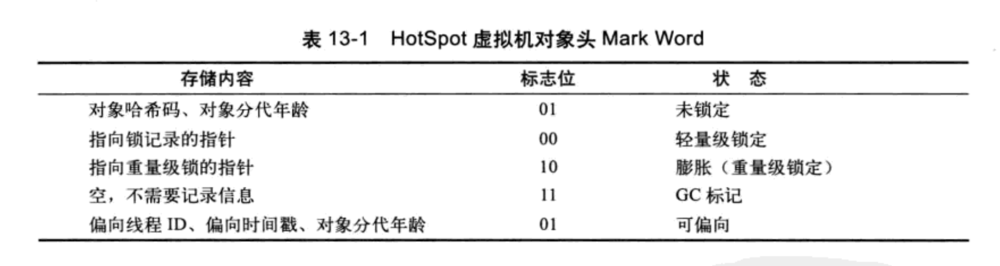
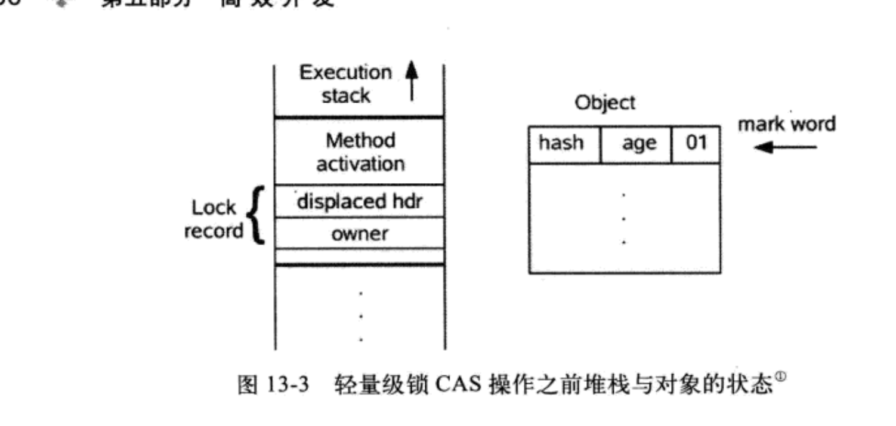
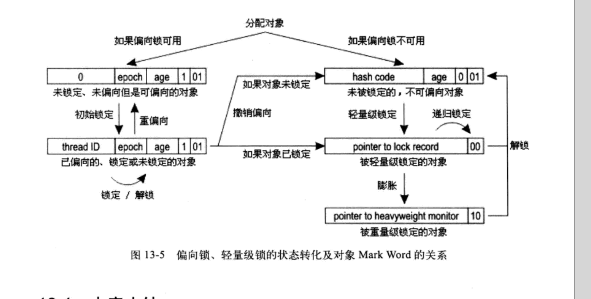

1. 自旋和自适应自旋
       互斥同步的最大性能消耗在于阻塞的实现，也就是挂起线程和唤醒线程的消耗很大。jdk1.4.2引入了自旋锁，但是**默认是关闭**的可以使用-xx:+UsingSpinning 来开启。但是**jdk1.6已经是默认开启**了。自旋不是用来代替阻塞的，因为**自旋锁是会占用cpu**时间的。但是可以避免线程切换的开销。自旋次数**默认是10次**。
       自适应自旋：自适应意味着自旋的次数和时间都不在固定了。而是由**前一次自旋的时间和锁拥有状态来决定**的。

2. 锁消除
        锁消除：指的是虚拟机即时编译器在运行的时候，对一些代码要求同步。但是被检测到不可能存在共享数据竞争的锁进行消除。锁消除的判断来源**逃逸分析的数据支持**。就是用到的数据都不会逃逸出去被其他的线程访问到。

3. 锁粗化
        锁粗化：原则上我们在编写代码的时候总是推荐把同步的代码块尽量小。只是在**实际共享数据的时候才加锁**,但是如果一系列的操作对同一个对象反复加锁的话。甚至有些锁会出现在循环体内。这样会把锁扩大到，循环体外。保证加锁和释放锁的操作不至于重复。

4. 轻量级锁
       所谓的轻量级锁是和synchronized这种传统的重量级锁对比的。轻量级锁不是用来代替重量级锁的，本意**是在没有多线程竞争的前提下，减少使用重量级锁使用系统互斥量带来的消耗**。

   1. 轻量级锁的执行过程：要说执行过程必须先知道锁的位置：

      1. 在代码进入同步块的情况下，如果对象没有被锁定也就是标志位是01，**虚拟机会先在当前栈帧创建一个锁记录(lock record)的空间用于存储当前锁对象的mark word**（官方把这个叫做displace mark word）
         
         然后**通过cas**尝试把mark word 指向我们创建的锁空间，如果成功了，当前线程就拥有了，我们对象的锁。同时会把标志位改成00 .**但是如果cas的操作失败了，虚拟机会先检查当前mark word是否指向当前线程的栈帧。如果是继续执行同步代码块**。如果不是就要开始锁膨胀了。这个时候会把标志位改成10 然后mark word是指向重量级锁的指针。后面的线程也会阻塞。

      2. 轻量级锁的解锁过程也是cas操作的。如果当前对象的mark word指向线程的锁记录，就尝试换回来。**如果这个操作失败了。就说明其他的线程尝试获取这个锁了。释放锁的同时唤起等待的线程**

         ps: 轻量级锁的关键在于它没有互斥量的开销。但是如果存在了竞争，就会导致同时存在互斥量的开销和cas的开销，这样的话比传统的锁还慢一些。

5. 偏向锁

   ​     偏向锁是jdk1.6引入的一种锁优化。他的目的是在无竞争的前提下消除同步语句。如果轻量级锁是在无竞争的前提下使用cas，来代替互斥量的开销。那么偏向锁就是连cas都不要了。

   ​     偏向锁在第一次获取锁的时候会把对象头的标志设置成01，然后通过cas把自己线程的ID放入到mark word中，如果下次这个持有偏向锁的线程再来获取就不用任何操作了。

   上图是偏向锁和轻量级锁的转化过程