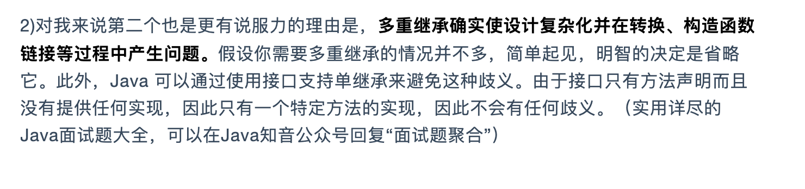

# Java中的 wait 和 notify 为什么生命中在object里面？

	1. 这个两个方法不仅仅是普调方法和工具，更是两个线程之间的通信方式。
 	2. 每一个对象都可以上锁，这也是其中一个原因
 	3. Java中代码进入临界区，线程需要锁定并等待锁定。
 	4. 

# java 为什么不支持多继承

	1.  菱形集成方法多态有歧义
 	2.  

# java 为什么不支持运算符重载

	1. 简单清晰 
 	2. 避免编程错误
 	3. Jvm 的复杂性，运算符重载完全可以通过方法重载来实现，从jvm角度来看，运算符重载会增加复杂性
 	4. 方便开发工具

#  String  为什么是final的

	1.  如果字符串是可变的那么，字符串池就不可用了。
 	2.  Java类里面有很多String 参数。
 	3.  线程安全的类（subString 的内存泄漏）
 	4.  允许**String 缓存其哈希码**
 	5.  **String 不可变的绝对最重要的原因是它被类加载机制使用，因此具有深刻和基本的安全考虑。**

# java 中可序列化和可外部化有什么区别

	1.  可外部化我们可以控制序列化的具体方式
 	2.  可序列化里面没有方法只有一个静态字段
 	3.  如果没有定义**serialVersionUID** 只要对类有增减字段之前序列化的类都无法修复，反序列化
 	4.  静态成员和trasient变量是不会被序列化的
 	5.  对象实现序列化接口，所有的成员同样需要实现序列化接口，不然就无法序列化
 	6.  无论父类是否实现序列化接口都将执行构造函数。来初始化父类的变量
 	7.  如果父类实现了序列化 ，在子类中可以实现readObject和writeObject 来避免序列化
 	8.  