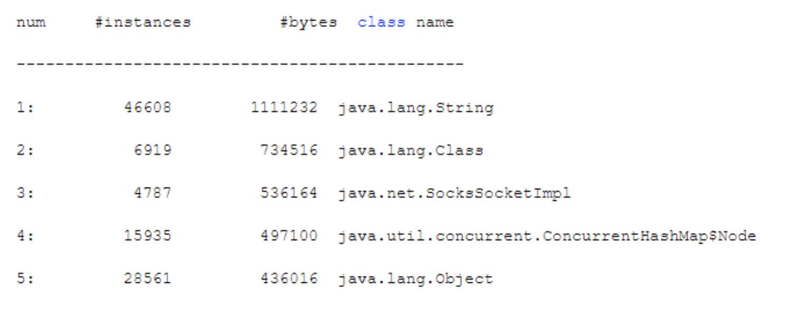

# java 线上内存查看的相关命令

1. jstat -gc pid(进程ID可以通过jps命令看到)接下来是命令输出的列的对应 jstat -gc PID 1000 10 1000毫秒输出一次信息，一共输出10次
   1. S0C：这是From Survivor区的大小
   2. S1C：这是To Survivor区的大小
   3. S0U：这是From Survivor区当前使用的内存大小
   4. S1U：这是To Survivor区当前使用的内存大小
   5. EC：这是Eden区的大小
   6. EU：这是Eden区当前使用的内存大小
   7. OC：这是老年代的大小
   8. OU：这是老年代当前使用的内存大小
   9. MC：这是方法区（永久代、元数据区）的大小
   10. MU：这是方法区（永久代、元数据区）的当前使用的内存大小
   11. YGC：这是系统运行迄今为止的Young GC次数
   12. YGCT：这是Young GC的耗时
   13. FGC：这是系统运行迄今为止的Full GC次数
   14. FGCT：这是Full GC的耗时
   15. GCT：这是所有GC的总耗时
2. 相关其他的命令
   1. jstat -gccapacity PID：堆内存分析
   2. jstat -gcnew PID：年轻代GC分析，这里的TT和MTT可以看到对象在年轻代存活的年龄和存活的最大年龄
   3. jstat -gcnewcapacity PID：年轻代内存分析
   4. jstat -gcold PID：老年代GC分析
   5. jstat -gcoldcapacity PID：老年代内存分析
   6. jstat -gcmetacapacity PID：元数据区内存分析
3. 通过上述的命令可以分析出来对应的新生代内存增长速率。可以分析出来平均的young gc 的耗时，以及老年代的增长速率
4. jmap和jhat摸清线上对象的分布情况
   1. jmap -heap PID 显示出来各个分区的内存情况
   2. jmap -histo PID 
      这里面是按照对象的大小来排序的class 信息
   3. **jmap -dump:live,format=b,file=dump.hprof PID** 生成堆转储快照，生成一个二进制的快照信息
5. jhat 来分析堆转储快照信息 jhat fileName -port 7000 下载下来以后可以用jhat 来打开浏览器窗口来看对应的信息

-XX:SoftRefLRUPolicyMSPerMB=0 这个是用来回收软引用的，一般不要设置成0
-XX:+DisableExplicitGC 禁用显示gc

mat 工具也是用来分析堆转储的工具

66