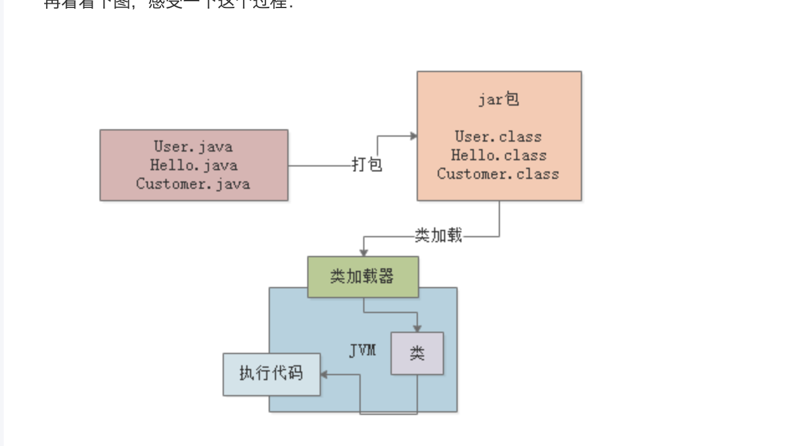
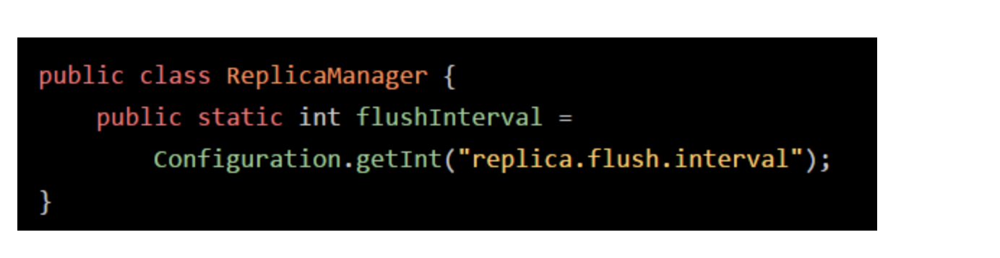
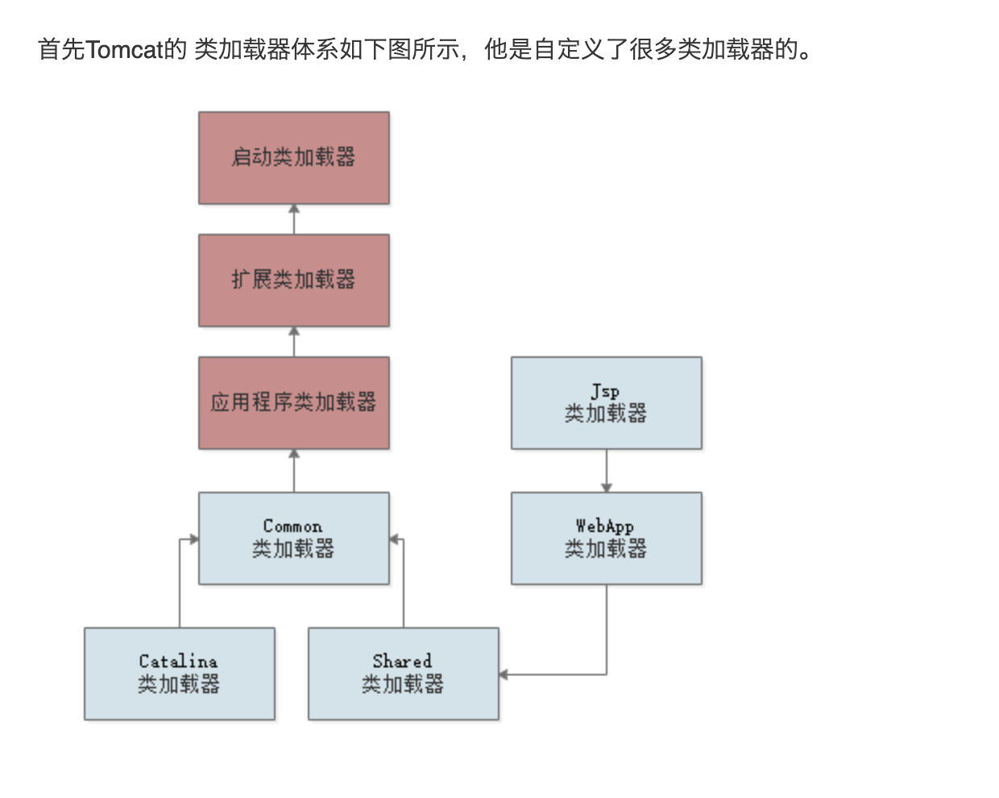

# jvm的基本运行和类加载的简单流程

1. Java代码的基本运行原理

   
   可以看到我们需要一个类加载器来加载我们的类进入到jvm，然后才可以运行。

2. jvm 什么情况会加载一个类？类加载的过程

   1. 类的加载到使用过程一般有以下几个步骤：**加载、验证、准备、解析、初始化、使用、卸载**
   2. 什么时候会加载这个类呢？简单说就是什么时候用到了就加载(**懒加载**)

   **验证阶段：**主要是验证以下是否符合我们的jvm要求比如版本等只有符合我们规范的才可以进入到jvm使用

   **准备阶段：**给对应的class分配空间，然后给**静态变量赋初始值**

   **解析阶段：**符号引用替换为直接引用的过程

   **初始化阶段：**
   
   这个阶段很重要：比如说 int类型的值在准备阶段只是给一个Java的默认值0，而不是配置中的数字，这个一个阶段就会赋值成对应的配置结果。**初始化规则必须先初始化父类**加载器不在这里赘述

   类初始化的时机：

    1.当创建某个类的新实例时（如通过new或者反射，克隆，反序列化等）

    2.当调用某个类的静态方法时

    3.当使用某个类或接口的静态字段时

    4.调用Java API中的某些反射方法时，比如类Class中的方法，或者java.lang.reflect中的类的方法时

    5.当初始化某个子类时

    6.当虚拟机启动某个被标明为启动类的类（即包含main方法的那个类） 所以System.ou.println(Test.class)不满足上面6种情况，也就没有做初始化

# Tomcat 的类加载特殊之处和Java的内存分区

1. 存放类的方法区，在jdk1.8以前名字叫方法去，1.8以后改名字了，Metaspace(元数据空间)。
2. 存放代码运行位置的程序计数器
3. 存放Java内部方法的Java 虚拟机栈
4. 存放对象的Java堆
5. Java本地方法的 本地方法栈
6. Java的堆外内存(allocateDirect 这种方法)

Tomcat 打破了双亲委派模型，自己的web应用有底层加载器直接加载。

# java 垃圾回收开启 Java对象有多大

1. 对象大小主要有两部分**对象头和对象的实例数据**对象头一般是16字节
2. Java的 class什么时候回收
   1. 没有这个class的对象
   2. 加载这个class的classloader 已经被回收了，不可能通过其他的方式增加对象了

# Java 对象的晋升机制

	1. 空间担保机制
 	2. 动态年龄判断机制
 	3. 指定年龄机制
 	4. 大对象机制

# Java 系统的元数据空间大小怎么设置

1. 一般几百M TODO增加案例分析
2. 栈内存一般1M到512Kb都可以的