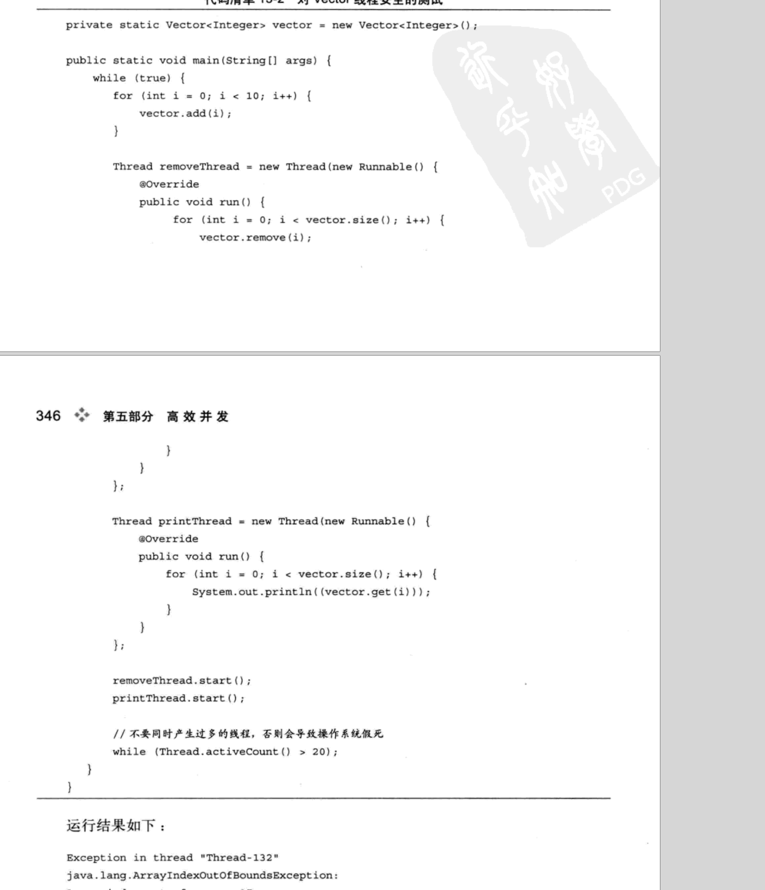

# 线程安全相关

1. 线程安全定义：
     当多线程访问一个对象的时候，**如果不用考虑这些线程在运行时环境下的调度和交替执行，也不需要额外的同步工作，或者在调用时进行其他的任何协调工作，调用这个对象就可以获得正确的结果**，那么这个对象就是线程安全的。

2. java 各种操作数据可以分为五类

   1. 不可变(只要对象被安全的创建出来,不发生this 逃逸就是绝对线程安全的)
   2. 绝对线程安全(必须完全满足上面给出的定义 Java中给出的大部分线程安全的类，都不是绝对线程安全的比如vector)
   3. 相对线程安全 （这个层级基本上是我们通常说的线程安全，它保证单独的操作是线程安全的）
   4. 线程兼容（本身不是线程安全的，一般我们说的线程不安全就是这种比如hashmap可以使用同步措施来保证安全）
   5. 线程对立（这里指的是无论你是否使用同步措施，都没有办法在多线程环境下使用）

3. 线程安全的实现方案

   1. 互斥同步 比如直接使用synchronized和可重入锁
   2. 非阻塞同步 比如cas
   3. 无同步方案 比如可重入代码块。比如threadlocal 线程本地存储

   