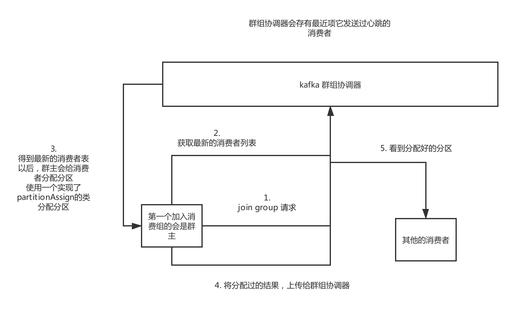

# kafka消费者

​	kafka消费组，是多个消费者组成的一个消费群组。同一个消费组订阅的同一个主题，每一个消费者接受一部分分区的消息。

​	同一个消费组如果消费者的数量大于分区的数量，那么多余的消费者会被闲置。向消费组里面增加消费者是提升消费能力的一种方式。

​	分区再均衡指的是分区所有权从一个消费者转移到另外的消费者的过程。在再均衡期间，消费者将会出现短暂的不可用。

​	群组协调器的作用过程：

​		

​	消费者通过向**被指派为群组协调器的broker**发送心跳，在获取消息或者提交偏移量的时候发送心跳。

​	后面剥离了心跳频率和获取消息的关联，通过新建一个心跳线程来处理的。	

# 消费者的主要参数

消费者的配置参数:

1.  fetch.min.btyes 每一次获取的最小字节数量，如果可用数据量小于，就会等待，这样可以降低消费者的负载。
2.  fetch.max.wait.ms 每一次获取数据最大的等待时间。默认是500毫秒，**这个和数据量，有一个满足就会返回取到的数据了。**
   3.  max.paratition.fetch.bytes 指定每一个服务器从每一个分区里面返回给消费者的最大数据量大小，这个值必须比消息的最大大小不然就会导致部分消息无法获取。**默认值是1MB**
   4.  session.timeout.ms 这个代表的是消费者被认为死亡之前的最后一次会话时间，超过这个时间就可以认为消费者的已经死掉了。进行分区再平衡。
   5.  heart.interval.ms 指定了poll方法向群组协调器发送心跳的频率。这个一般是死亡确认时间的三分之一。
   6.  auto.offset.reset 当一个消费分区没有偏移量或者失效过久，导致偏移量丢失(包涵偏移量的记录被删除了)，默认值latest 最新的记录。earliest 最早的记录。表示失效或者新的消费组加入以后从哪里开始读取消息记录。
   7.  enable.auto.commit 默认是自动提交，这个表示的消费者提交偏移量的方式。auto.commit.interva.ms 这定义了提交偏移量的时间间隔
   8.  partition.assignment.strategy 分区分配的方式 range 范围分配策略，
         **就是整除一下，然后按照顺序分配，第一个消费者会比其他的消费者，分区多。** 按照顺序分配就是 1-3 分给第一个消费者
         **roundrobin该策略会把主题的分区逐个的分配给消费者。**
   9.  max.poll.records 每一次最多取回多少条记录。

# 提交和偏移量

​	为了保证我们poll每次获取都是没有消费过的数据，就必须要保存我们消费了多少数据，修改这个消费多少的过程就是提交了。

​	偏移量表示已经消费了该分区下多少数据。

​	偏移量主要在有消费者崩溃，或者是有新的消费者加入消费组的时候，起到作用。如果读取的消费偏移量比实际处理的偏移量要小，就会重复消费两个差值之间的数据。

​	提交方式：

1. 自动提交，默认提交间隔是5s。这个是上次提交和到再均衡时间内拉取的数据会被重复消费
2. 提交当前偏移量。使用commitsync 可以提交最新的偏移量。如果失败就抛出异常，这个是上次提交到这次消费的数据会被重复消费。
3. 异步提交，上面的提交当前是手动提交的这个会在broker返回之前一直阻塞消费者，这就限制了消费者的吞吐量。但是异步提交如果提交失败是不会重试的。上面的同步提交会重试。
4. 如果提交偏移量的速度需要和消费的消息的频率不一样，也可以通过提交特定偏移量的方式来提交，但是这样需要自己维护每一个分区的偏移量。
5. 同步和异步交叉使用指的是，在消息消费执行异步提交，但是关闭消费者使用同步提交，会一直重试直到成功为止。

#	再均衡监听器

​	再均衡监听器的主要作用是在发生消费者的新增或者减少的时候(也可以是新增或者删除分区的时候)，在调用 subscribe() 方法传入一个ConsumerRebalanceListener(这是一个接口)对象即可。这个类有两个方法需要实现.

1. onPartitionRevoked 这个方法会在再均衡开始之前被调用。这里可以用于提交偏移量等等。
2. onPartitionAssinged 这个方法会在再均衡结束，开始消费之前调用。

# 从特定偏移量开始消费消息

​	我们知道poll方法可以从各个分区的最新偏移量来处理消息。如果想从分区的开始和分区的结尾开始消费消息，可以通过seekToBegining 和seekToEnd来实现。

​	同样的kafka还支持从分区的特定位置来读取消息。consumer 的seek方法可以通过传入特定的偏移量来实现从特定位置开始消费消息。

​	

# 如何正确的退出消费者

​	consumer的wakeup方法可以抛出一个异常，然后捕获这个异常，进行consumer.close方法，这个close会提交任何没有提交的东西，然后向群组协调器，发出一个消息，说要退出群组。然后就会发生再均衡。不用等待回话超时。

# 如何使用一个没有消费组的消费者

​	consumer 可以自己指定自己想消费的特定分区或者是某个topic，但是不可以同时加入消费组和自己指定自己的消费分区。