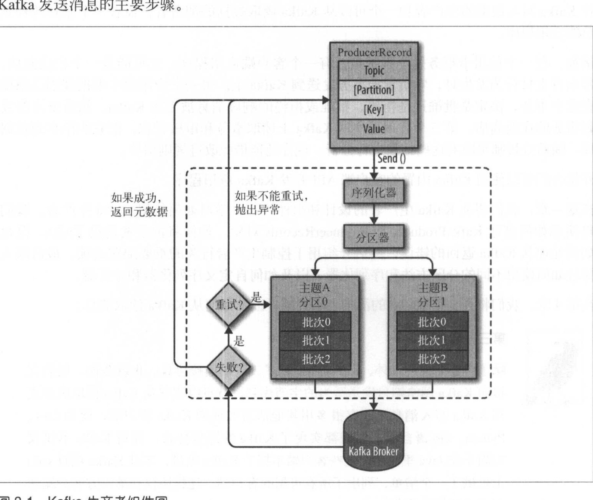

# kafka 生产者

​	生产者发送消息的过程主要如下：

​	上图中可以看到是先放入到本地的缓冲区中，然后由一个独立的线程会把这些记录下来的数据分批次发送到broker上去。

​	如果消息成功写如到broker上，就返回一个RecordMetaData，包涵分区信息和主题信息。以及记录在分区里面的偏移量。如果失败了，会重试重试次数可以设置，如果到了重试次数以后还是失败就返回失败。

​	生产者必须要的三个信息：

 1. bootstrap.servers broker的地址清单，至少应该有两个，不用包涵所有的，两个是为了防止一个宕机。

 2. key.serializer序列化器，客户端默认提供了byteArraySerializer ，StringSerializer 和IntegerSerializer 如果只是使用默认的几种基本类型，可以不用实现自己的序列化器。但是必须设置序列化器,即使你没有key

 3. value.Serializer 和key.Serializer一样，必须设置。

    

​    发送消息的模式：

   1. 发送并忘记，这个不关心消息有没有被broker接收到

   2. 同步发送，send 发送消息以后会返回一个future对象调用get方法等待，就可以知道发送是否成功

   3. 异步发送，可以指定一个回调函数，等服务器回调即可

      ​	

​	发送消息的参数：

1. ProducerRecord
2. 我们如果忽略了，Send 的返回值。这样就会不知道发送的结果。对于部分不重要的消息发送可以使用这种处理方式但是发送前也可能出现部分的错误。比如序列化失败或者是发送线程中断，或者是缓冲区已经满了

发送的重试机制，重试机制并不是对于所有的消息发送失败都是会重试的，失败分为以下两类

1. 可重试错误，比如链接错误，比如broker无leader错误。
2. 不可重试错误，比如消息太大错误。就不会进行任何的重试操作

生产者参数acks配置：

1. acks 指定的必须多少个副本收到消息才算发送成功。acks = 0 不需要任何服务器的响应就认为发送成功，丢失消息的可能性很大，
2. acks = 1 需要首领节点接收到消息算成功。有可能会丢失消息，比如首领节点崩溃，后来选出的leader没有收到消息。
3. acks = all 这样的延迟会比较高，必须所有的(节点都收到消息才算发送成功，吞吐量比较低
4. 生产者参数buffer.memory 缓存区的大小
5. 生产者参数compression.type 指定压缩方式
6. 生产者参数 retries当生产者发送消息遇到可重试错误的时候，这个参数决定了重试的次数。默认重试是100ms间隔，可以根据retries.backoff.ms来设定
7. 生产者参数batch.size，图1中的批次大小，这里不一定会等到批次满了才会发送消息。
8. 生产者参数linger.ms指的是发送批次前等待消息的时间，默认只要有可用的线程就会发送消息。设置为比0大的数字可以提升吞吐量
9. 生产者参数max.request.size 可以指定发送的最大单个消息的大小

# 顺序保证

​	kafka 只保证分区内的顺序。所以如果要求有序就应该max.in.flight.requests.per.connection设置为1.这样当发送重试的时候就不会发送其他的消息来保证顺序。	

# 分区键

​	分区的键可以不设置，如果不设置默认是认为null，kafka会轮询来平衡分布都每一个分区。如果指定了分区键就会使得同一个键的消息发送到同一个分区。如果对应的分区不可用就会失败。但是如果分区数量发生了变化，可能也会发生变换分区的可能性。

​	如果数据分布不均匀，就会发生有的分区大有的分区小，就需要自定义分区策略。Partitioner 实现这个接口就可以了

kafka 的高吞吐量主要通过以下几个方式来实习那

1. 顺序读写
2. mmp 内存映射
3. 0拷贝
4. 多分区
5. 数据压缩
6. 批量发送