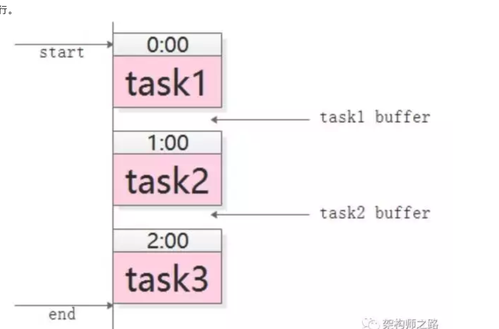

消息队列是干什么的

1. 消息队列是一个互联网的解耦利器。

2. 消息队列是跨进程通信的一种方式

   

#  消息队列的缺点

	1. 系统更加复杂增加了一个消息队列的组件
 	2. 消息传递的路径通常会更长，会有一定的延时
 	3. 消息的可靠性和重复性是比较矛盾的。
 	4. 上游无法知道下游的执行结果

# 消息队列的使用场景

 1. 数据驱动型的依赖
    task1的输出作为task2的输入

 2. 上游不关心下游的执行结果。有多个下游的时候适宜多个调用
    优点是：执行时间短,增加下游不需要上游改动，上游逻辑和下游逻辑解耦

 3. 上游关心下游执行结果，但是下游执行时间很长。一般是使用回调来实现。

 4. 广播的消息一般使用消息队列来做。

    

# 消息的延时消息实现

​	使用场景：比如48小时以后默认五星操作。比如半小时以后没有付款的订单自动取消。有时候会用定时任务来实现，但是有重复扫描和延时的情况出现。效率低。

​	实现的方案是：环形队列和任务集合

​	

# 消息必达实现方式

1. 超时重传回调落地分布式存储
2. 消费重传，消费确认。存在重复消费问题。

# 消息幂等性

1. 上半场 生产者到消息队列服务器。需要服务器内部的唯一ID来保证生产者发送的重复消息只保存一条
2. 下半场 消息队列服务器到消费者。需要生产者带有唯一的业务ID来保证消费者的幂等性，同时消费者也要有重复处理逻辑

