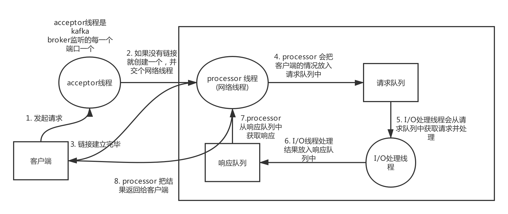
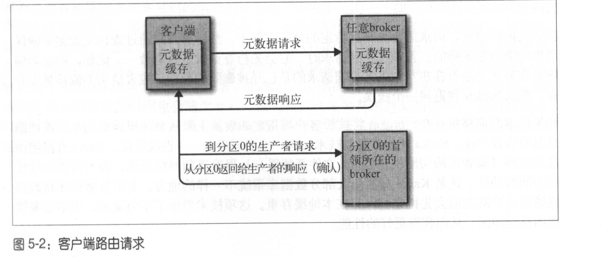
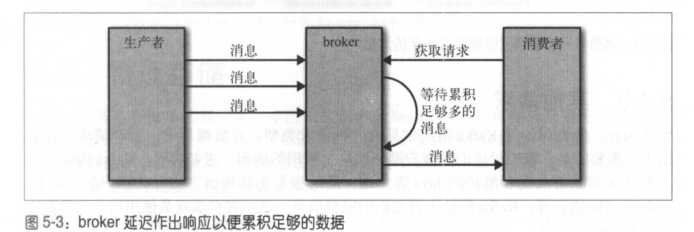
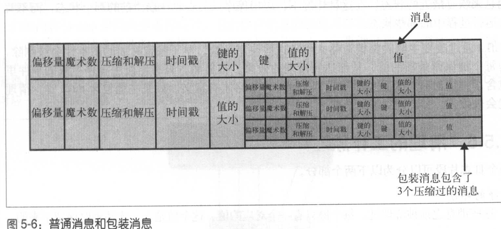

# 深入理解kafka

## 	1. kafka如何复制

​	broker 有一个唯一标识符(id)可以指定，也可以自动生成。通过注册到zookeeper下临时节点。来通知集群，有新加或者节点退出。

​	如果发生了长时间的垃圾回收或者网络分区之类。broker会从zookeeper的临时节点中删除。这个时候如果启动一个和被删除的节点一样的ID的broker，它会立即加入集群并含有和旧的broker的一样的主题和分区。

​	控制器就是一个特殊的broker，除了正常的broker，**还有分区首领的选举功能**。通过在/Controller 下面创建临时节点来成为控制器。当有broker挂掉的时候，控制器会知道，然后如果有分区首领在这个broker上，就获取分区副本的下一个分区副本成为新的分区首领。

​	控制器通过epoch来避免脑裂。脑裂指的是有两个broker认为自己是控制器

​	副本有两种类型：

1.  首领副本
2. 跟随者副本

​	跟随者只会从首领副本获取消息，如果跟随者副本在10s内，没有请求最新消息或者没有请求消息。他就不可能在首领副本失效的时候成为新的首领，反之持续同步的就是同步副本。**只有同步副本才可能成为新的首领（也就是所谓的ISR）。**

​	首选首领：创建主题的时候指定的首领就是首选首领。希望在首选首领成为分区首领的情况下，负载是基本均衡的。

## 	2. kafaka如何处理消费者和生产者的请求	

​	因为所有的生产请求和消费请求都必须发送到首领副本，客户端就必须知道每一个分区的首领副本对应的broker。通过发送元数据请求来获取这些元数据信息。

​	kafka处理客户端请求的全过程图：

​	

​	客户端需要自己负责把自己的请求发送到正确的首领副本所在broker上去。这样就需要元数据信息的请求。也就是客户端，需要订阅的所有的主题的分区数目和首领分区的所在broker的列表。**所有的broker都有这些元数据信息**。那么元数据信息的请求可以发送到任意一个broker上。

​	生产请求：副本首领的broker收到消息请求以后，会首先做些校验，比如写入权限和ack参数有效性，Linux系统会**首先写入到系统缓存中，并不保证何时刷新到磁盘上的**。如果acks参数是all请求会被放入到炼狱缓冲区中。直到所有的副本都收到消息，才返回给客户端。元数据是定时更新的如果发生了不是首领这个错误，就会立即更新元数据。

​	获取请求：客户端向broker请求主题分区中的特定偏移量的消息。客户端可以指定在broker从一个分区中最多返回多少数据。因为客户端需要给broker返回的数据分配足够的内存。**kafka使用零拷贝技术来给客户端发送消息，就是从Linux文件系统缓存直接到网络通道**。而且大部分客户端只可以获取到已经写入到同步副本的消息。

​	对于获取数据的请求，获取数据可以设置获取数据的下限和上限。客户端可以设置超时时间，超过这个时间即便没有达到数据量的下限也会返回数据。

​	其他请求：其他的请求比如同步数据，比如后来将偏移量存在broker上，这些都是broker可以处理的请求

## 	kafka存储细节

​	kafka 的基本存储单位是分区。分区无法在多个broker之间再细分，也无法在broker的多个磁盘上再分。所以kafka的分区大小受到单个挂载点的限制。

~~~ 一
（单个挂载点由单个磁盘或多个磁盘组成，如果配置了 JBOD ，就是单个磁盘，如果配置了
RAID ，就是多个磁盘。请参考第 2 章）
~~~

# kafka 的分区分配

​	分区分配应该有一下三个目标：

1. ​	broker之间应该是分区数量一致的
2. ​	每一个分区的副本不应该出现在相同的broker上
3. ​	如果broker指定 了机架信息，那么每一个分区的副本应该在不同的机架上	

​	在分配过程中如果没有机架信息就会随机选择一个broker，然后顺序分配分区。但是broker在分配分区的时候没有考虑可用空间和工作负载的问题。但是分区分配到磁盘上的时候会考虑分区的数量，但是不会考虑剩余磁盘空间的大小问题。

# kafka的文件管理

​	kafka不会一直保留文件。管理员可以规定数据被删除之前可以保留多长时间，或者是最多保留多大的数据。

​	为了提升查找的效率，kafka把文件分成多个段。默认是一个G或者是一周的数据。当前写入的片段成为活跃片段。是不可以被删除。

# kafka文件格式

​	如果生产者发送的是压缩过的消息。那么同一个批次的消息会被压缩到一起。当做包装消息发送。消费者解压以后会看到对应的偏移量和魔数信息。文件格式如果是压缩过的，会有更好的传输存储性能。

# kafka 索引

​	为了帮助broker迅速的定位到指定的偏移量。kafka给每一个分区都建立了索引。索引把偏移量映射到片段文件和偏移量在文件内的位置。索引同样被分成不同的片段。**这样删除文件的时候一样会删除索引。**删除索引是绝对安全的。因为kafka发现索引不正确，kafka会从新读取消息录制偏移量来重新建立索引。 

# kafka清理

​	kafka不仅可以支持根据设置的时间保留数据，还支持早于保留时间的旧事件就会被删除掉，只为每一个键保留最新的值，来达到清理的效果。但是这样的清理策略只对于事件含有键值对的时候为这些主题设置compact策略才有意义。而且如果有null键就会清理失败。（清理的两种策略 delete 和compact）

​	如果不需要使用这个键的数据了，就发送一个当前键，value是null的消息，也就是墓碑消息就可以了。kafka会在当包含脏记录的主题数量大于百分之五十的时候开始清理。