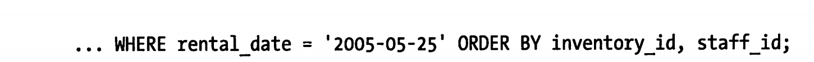

# MySQL索引相关第二部分

1. MySQL索引的扫描排序有两种

   - 使用索引顺序扫描(如果explain 的type 列的值是 index 就说明是索引扫描排序)，索引扫描本身是比较快的从这一条可以直接到下一条。但是如果需要回表就是随机I/O了。所以如果索引顺序读取数据比顺序全表是慢的
   - 通过排序操作 
     ps:（**如果上图中的读取行和排序结果是一样的就不用把所有的数据都读取出来然后进行排序了**，效率会好很多）

   1. 只有当**索引的顺序和order by的字段顺序完全一致而且每个字段的顺序(升序降序)都一样**才能使用索引对结果排序。
   2. 如果需要关联查询只有当order by 的字段都为第一张表的时候才能索引排序。排序的限制和查询的限制一样都是最左前缀
   3. 如果不能保证前缀的话，如果前面缺少的列是常量也可以的
   4. 不能使用索引排序的几种条件；
      1. 查询中使用了两种不同的排序，但是索引都是正序的
      2. 排序中使用了索引中没有的列
      3. 排序的字段无法组成索引前缀
      4. 在条件中第一列使用了范围查询使得无法利用后面的列

2. 压缩索引(前缀压缩)

   - 