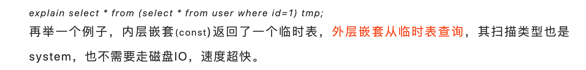
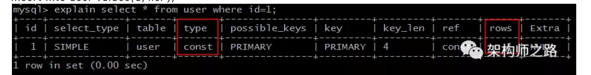

# explain type 和 extra

1. type的类型以下从快到慢一次列举
   1. system 系统表扫描 代表从mysql的系统表扫描，这些数据已经在内存里，不需要磁盘IO速度最快
      
   2. const 条件为
      1. 命中主键或者是非空唯一索引
      2. 被链接的部分是一个常量值上述主键是ID 值是常量1
   3. eq_ref  细化条件是：
      1. join 查询 
      2. 命中主键或者非空唯一索引
      3. 等值链接
   4. ref 条件是 普通唯一索引 （这个可以是join 也可以出现在单表普通索引里）
   5. range 比较好理解就是范围索引查询。
   6. index 这个就是锁需要扫描全部索引
   7. ALL 全表扫描

# Extra 解释

1. using where 使用条件过滤数据

2. using index 代表是索引覆盖，不需要访问实际的行数据

3. **Using index condition** 代表命中索引但是需要回表

4. **Using filesort** 代表得到所需结果但是需要文件排序，常见情况是对一个order by字段没有索引导致排序

5. **Using temporary** 使用临时表 典型场景  group by 和 order by 作用不同字段

6. **Using join buffer (Block Nested Loop)** 需要嵌套循环计算

   
   参考文章地址
   https://mp.weixin.qq.com/s?__biz=MjM5ODYxMDA5OQ==&mid=2651962587&idx=1&sn=d197aea0090ce93b156e0774c6dc3019&chksm=bd2d09078a5a801138922fb5f2b9bb7fdaace7e594d55f45ce4b3fc25cbb973bbc9b2deb2c31&scene=21#wechat_redirect