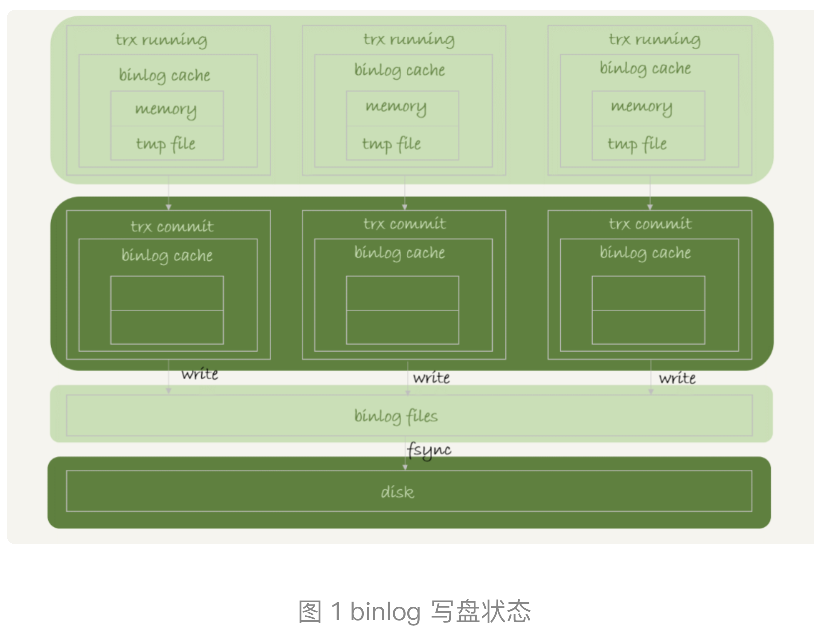
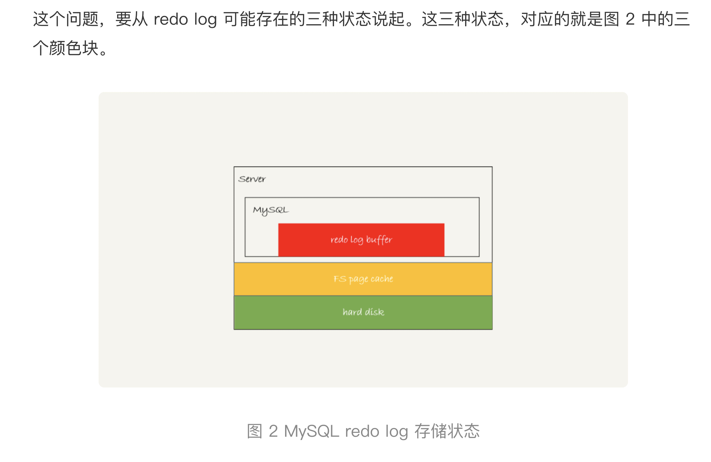

# mysql 加锁的原则

1. **加锁的基本单位是 next-key锁。是一个前开后闭的区间。**

2. **查找过程中访问的对象才会被加锁。**

   优化过程有下：

   	1. **索引上的等值查询，给唯一索引加锁的时候退化成了行锁**
    	2. **索引上的等值查询，向右遍历到第一个不符和条件的锁退化成间隙锁。**
    	3. 唯一索引上的范围查询会访问到不满足条件的第一个值为止。(有人说这个是一个bug)

3. https://time.geekbang.org/column/article/75659?code=Rk78pxwD3wzZFi2xq-idY2WA2Rif%2FE%2Fu76afty2%2FtVo%3D&utm_term=SPoster

4. 具体参考上面的这个文章。

5. 因为被访问的对象才会被加锁，所以如果是覆盖索引的查询，加锁是只会加在二级索引上的。主键索引上没有任何的锁。但是前提是lock in share model

# mysql binlog写入的机制

1. binlog写入的机制比较简单,先把日志写入到binlog cache事务提交以后就写入到对应的文件中去（只是写入到系统的page cache）。
2. 

图上可以看到

1. **sync_binlog=0 的时候，表示每次提交事务都只 write，不 fsync；**
2. **sync_binlog=1 的时候，表示每次提交事务都会执行 fsync；**
3. **sync_binlog=N(N>1) 的时候，表示每次提交事务都 write，但累积 N 个事务后才 fsync。**

  这个值可以根据具体的情况来确定，当时N的时候如果发生了机器宕机。会丢失最近的N个事务的binlog日志。

可以根据性能要求，来设置具体的数值。 

# redo log 的写入机制

1. 
   为了控制 redo log 的写入策略，InnoDB 提供了 innodb_flush_log_at_trx_commit 参数，它有三种可能取值

   1. **设置为 0 的时候，表示每次事务提交时都只是把 redo log 留在 redo log buffer 中 ;**
   2. **设置为 1 的时候，表示每次事务提交时都将 redo log 直接持久化到磁盘；**
   3. **设置为 2 的时候，表示每次事务提交时都只是把 redo log 写到 page cache。**

   **InnoDB 有一个后台线程，每隔 1 秒，**就会把 redo log buffer 中的日志，调用 write 写到文件系统的 page cache，然后调用 fsync 持久化到磁盘。

   还有两种场景会把redolog的日志刷新到磁盘，**一种是，redo log buffer 占用的空间即将达到 innodb_log_buffer_size 一半的时候，后台线程会主动写盘。注意，由于这个事务并没有提交，所以这个写盘动作只是 write，而没有调用 fsync，**也就是只留在了文件系统的 page cache。

   **另一种是，并行的事务提交的时候，顺带将这个事务的 redo log buffer 持久化到磁盘**。假设一个事务 A 执行到一半，已经写了一些 redo log 到 buffer 中，这时候有另外一个线程的事务 B 提交，如果 innodb_flush_log_at_trx_commit 设置的是 1，那么按照这个参数的逻辑，事务 B 要把 redo log buffer 里的日志全部持久化到磁盘。这时候，就会带上事务 A 在 redo log buffer 里的日志一起持久化到磁盘。

   