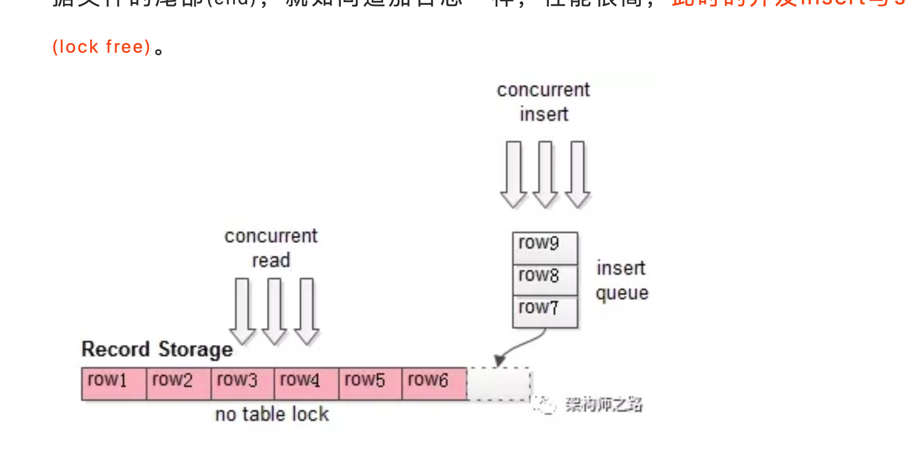

# mysql 实际应用场景

1. 表锁的好处
   1. 表锁占用内存比较少，行锁和记录的条数有关
   2. 如果业务经常读写表中大量的数据，表锁会更快，因为不需要管理太多的锁
   3. 如果经常是group by 同2 表锁会更快
2. 表锁 运行机制
   1. 读锁没有锁就加读锁，有锁就进入读锁队列
   2. 写锁，没有锁就加写锁，有锁就进入写锁队列
   3. 写锁优先级更高，比如读锁和写锁的队列中都有锁，写锁先出队列
3. 通过查看表锁的等待次数来判断是否有性能瓶颈，**Table_locks_immediate**这可以查看立即获得锁的次数
4. myIsam 如果没有文件空洞，就是说存储是连续的，这个时候读写都是不加锁的。写是入队列的。
   这个时候读锁是共享的，写是追加顺序且没有表锁争抢的，只是入队这个时候表锁性能很高，但是如果文件有空洞，就
   无法并发了，所以这个时候如果是插入和select 高并发myIsam是性能很不错的。
5. 
   这些场景都是使用表锁更好，开销更小