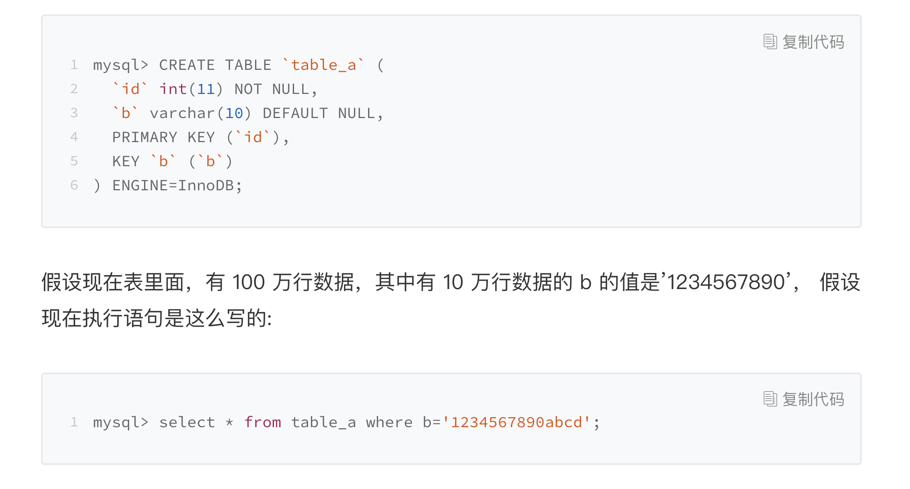

# mysql 常用查看状态命令

1. show processlist;可以用于查看当前语句的状态
   
   如图可以看到select 这条语句在等待锁。

   ```sql
   select blocking_pid
   from sys.schema_table_lock_waits;
   ```

   上面的sql可以查询到阻塞的进程ID
   

2. 等待flush
   select * from information_schema.processlist where id=1;
   

3. 等待行锁，所以当查一条数据的时候也可能会很慢

   select * from t sys.innodb_lock_waits where locked_table=`'test'.'t'`\G 可以尝试查哪个进程锁占用了。

4. 没有索引，扫描主键了 

5. 
   这个语句会先截断b,然后扫描全部数据并且回表肯定很慢