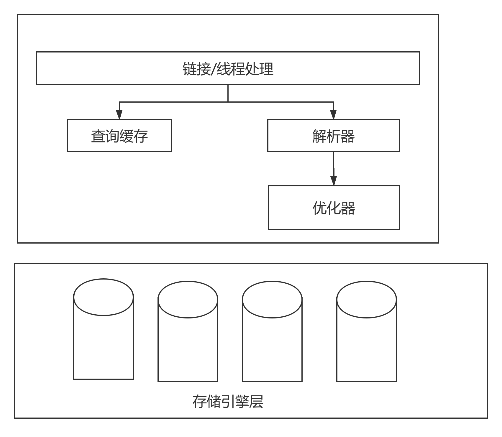
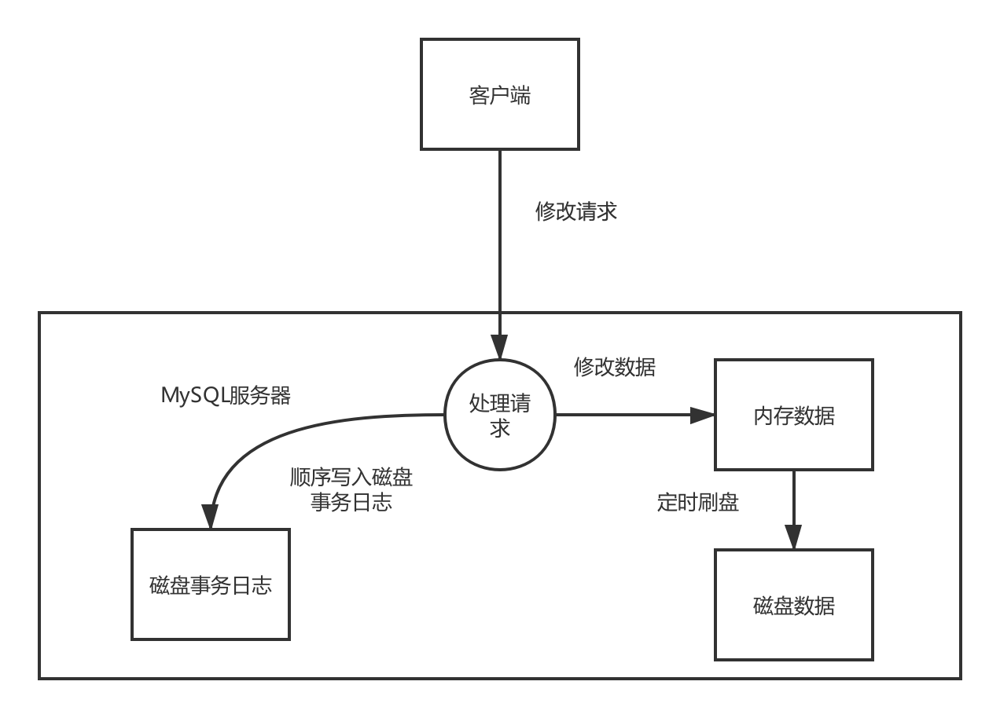

# mysql 架构图谱

1.  MySQL的内部整体架构
   所有跨存储引擎的东西都在解析器和优化器这一层。跨存储引擎的都是接口实现的。存储引擎在不同的系统中是不一样的。存储引擎只是简单的处理服务器的请求。存储引擎除了innodb之外都不会解析sql，innodb也只是解析外键的定义。
2. 链接和安全性
   - 服务器会缓存线程的管理。不会为每一个新建的链接新建或者销毁线程的
   - 而且链接成功以后会检查特定sql的执行权限。
3. 锁策略
   - 锁策略的主要解决问题就是在锁的开销和数据的安全性之间的权衡。
   - 表锁
   - 行锁
4. 事务的隔离级别
   - Read uncommitted 读未提交
   - read commited 读提交
   - repeatable read 可重复读(默认的隔离级别) 会有幻影读取(一个事务在读取ID 从1-20的数据，另外一个事务插入了一个id=10的数据就发生了幻影读)，MVCC解决了这个问题。
   - serializable 可串行化
5. 死锁
   - 当不同的事务按照不同的顺序请求不同的锁就可能发生死锁行为。Inodb的处理死锁办法是，把持有最少行业排他锁的事务回滚。而且innodb可以检测到死锁并抛出一个错误。
   - 锁的行为和顺序是和存储引擎有关的。
6. 事务日志
   - 事务日志先写入到磁盘然后修改的数据慢慢刷新会到磁盘就可以了，预写式日志。这样修改数据就需要写两次磁盘了。不过日志是追加方式顺序写磁盘很快的。
   - 
7. MySQL中的事务
   - MySQL提供两种事务引擎Innodb 和NDB cluster
   - auto commit(自动提交)，也就是说对每一个查询都是当做一个事务提交操作。这个可以设置的但是对于修改内存表myisam这种没有效果**默认值是自动提交**，另外还有一些命令会强制提交当前活动的事务。
8.  事务是由存储引擎实现的。
   - 如果混合使用了事务引擎和非事务引擎是不会报错的，但是非事务引擎的操作**是不会被回滚的哟**
9.  innodb使用的是两阶段锁定协议，事务在执行中随时可以锁定，只有到commit或者rollback的时候才会释放。innodb也是支持显式锁定。比如 lock in share model，for update
10.  对版本并发控制(MVCC)
   - Innodb 是通过行最后的两个隐藏列来实现的MVCC,一列保存了创建版本，一列保存了删除版本。
   - select 只会返回 创建版本小于当前版本和删除版本大于当前版本的数据
   - insert 会把当前事务版本作为创建版本
   - delete会把当前事务版本作为删除版本
   - update 会Innodb插入一行新纪录，当前版本作为创建版本，旧的记录当前版本为删除记录
     MVCC 只对可重复读和读提交生效，因为读未提交，总是最新的数据，可串行化是所有的读都加锁。
11.  

