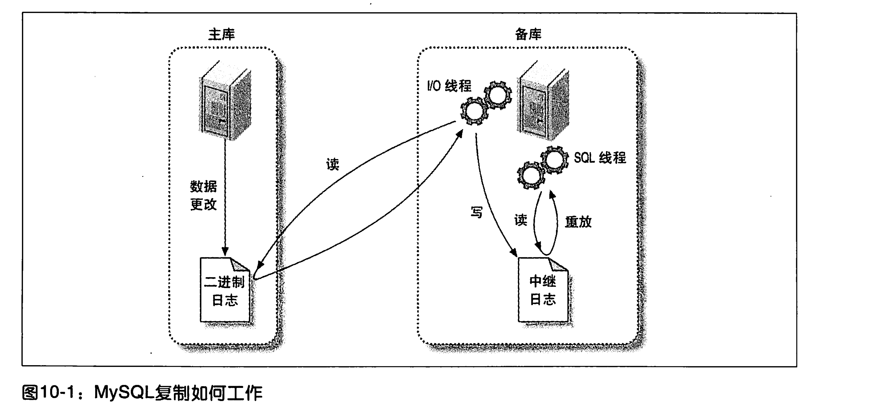

# mysql 的复制

1. 复制解决的问题是： 让一台服务器和其他的服务数据保持同步。ps:一台服务器可以同时是一台机器的备库，另外一台记得主库。

2. mysql复制的两种方式：ps:两种方式都是通过二进制日志，备库通过重放log来做的，这样同一时刻是有不同的也就有延迟。

   1. 基于行复制 5.1版本才加进来的。

   2. 基于语句复制 这个比较早3.23版本就有了

      myql的复制是向后兼容的也就是**只能低版本的服务做高版本的主库**，不能反过来。

3. 复制的常见用途

   1. 数据分布
   2. 负载均衡 读写分离
   3. 备份的补充
   4. 高可用性和故障切换
   5. mysql升级测试 在没有升级全部实例的情况下可以在备库上先执行
   
4. 复制的工作原理

   1. 在主库上把更改记录到二进制日志中 binary log (mysql会按照事务提交的顺序而不是每条语句执行的顺序来记录二进制日志)
   2. 备库把主库的日志复制到自己的中继日志中 relay log  (备库会启动一个I/O线程，会和主库创建一个链接，然后在主库上创建 一个二进制转储线程 binlog dump，不会事件轮训。如果追上主库就休眠)
   3. 备库读取中继日志然后，把其放入到备库上。 (sql 线程负责重新播放中继日志实现数据的一致)

5. 复制的原理