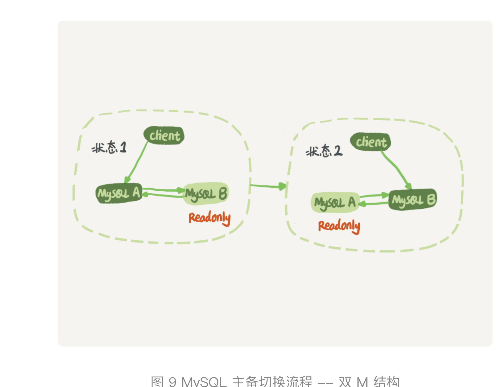
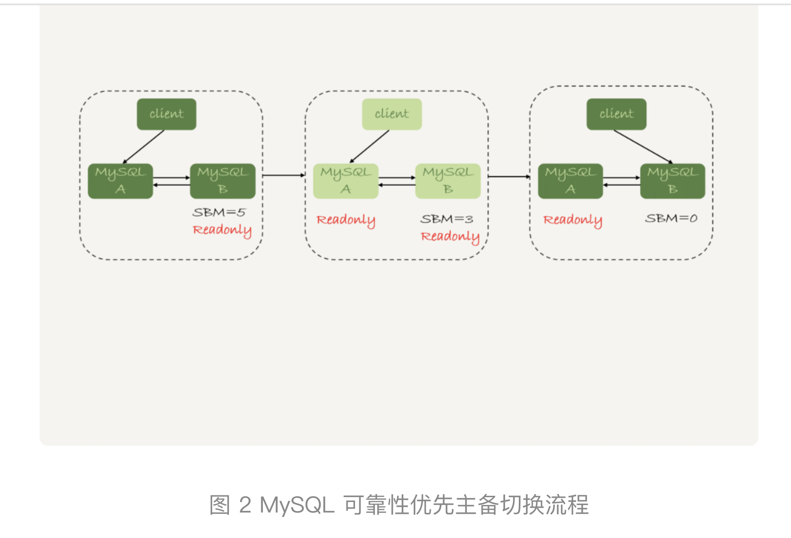
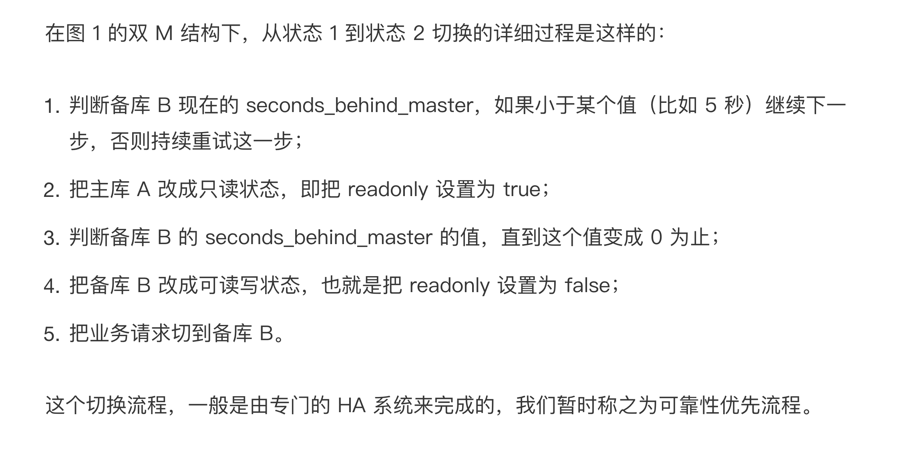
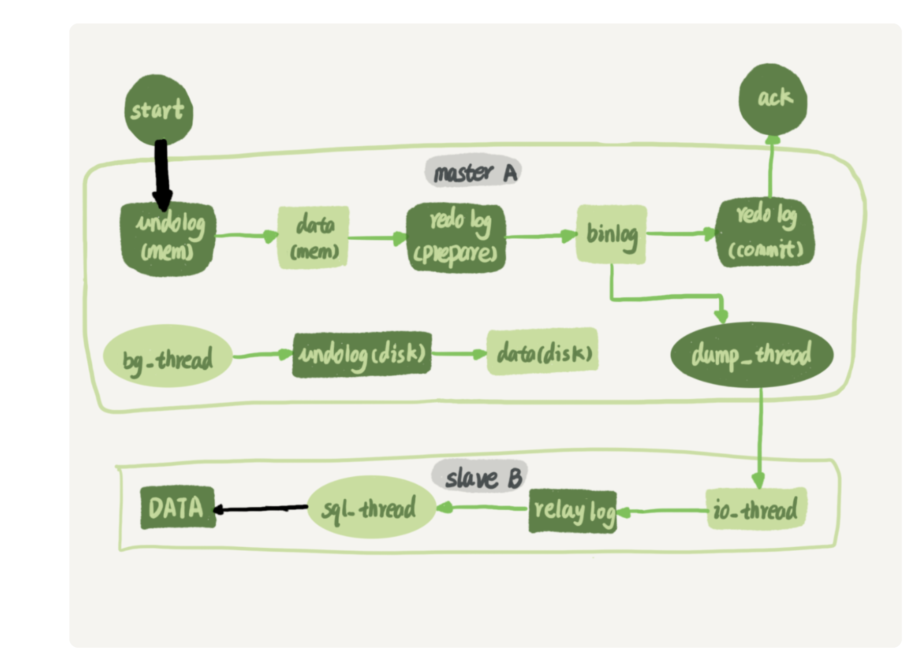
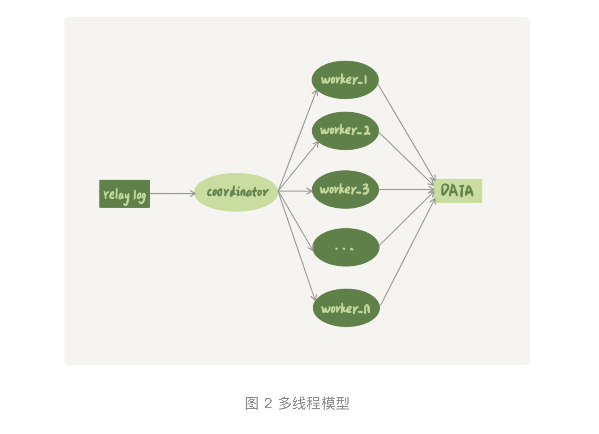

# mysql 复制的循环复制问题

1. mysql通过binlog的主从复制已经可以保证备库和主库的一致性。

   **双主架构中的问题是**库A和库B是互为主备的。这个时候库A执行语句生成的binlog，会到B执行，B执行以后又会生成binlog。这个时候会有循环复制的问题。
   **解决方案：**

   1. 规定两个库的serverId不可以相同，
   2. 备库做重放binlog的时候需要生成与binlog相同的serverId的binlog。
   3. 备库重放binlog的是检测到binlog的serverId和自己的一样就丢弃这个binlog日志。

# mysql 高可用的实现

## 1. 主备延迟

	1. 可以通过在备库上执行show slave status；来查看主备的延迟。seconds_behind_master，用于表示当前备库延迟了多少秒
 	2. 主备时间不一致不会导致主备延迟计算有问题。主备延迟的主要原因在哪里，备库消费中转日志（relay log）比主库的会慢才是主要原因。接下来是为什么会慢：
      	1. **首先有些时候的主备库的性能是不一样的。**
      	2. **当主备库的性能一样的时候呢第二种就是备库压力大，比如有些运营的语句慢SQL之类的。导致影响了数据库的主备同步**
      	3. **大事务也会导致主从延迟**(不要一次性地用 delete 语句删除太多数据。其实，这就是一个典型的大事务场景、另一种典型的大事务场景，就是大表 DDL
      	4. **就是备库的并行复制能力也是导致主备延迟的一个重要原因**
	3. 处理主备延迟的方案：
    	1. 增加备库
    	2. 把主库的binlog发送到其他的系统，由其他的系统来实现统计的任务。 比如Hadoop系统。
    	3. 尽量不要出现很大的事务

## 2. 主备延迟出现以后主备切换的方案

1. 可靠性优先策略

   
   第三步是比较耗时的。有出现不可用时间

2. 可用性优先策略
   这种方案就是把可靠性优先的第四五步先做了。
   **出现的问题：**在双m，且binlog_format=mixed，会导致主备数据不一致，使用使用 row 格式的 binlog 时，数据不一致的问题更容易发现，因为binlog row会记录字段的所有值。

## 3. 从库为什么可以延迟几个小时？？？？

1. 

   
   coordinator 是原来更新数据的线程，现在只负责读取中转日志和转发日志。**work线程用于更新数据，建议在CPU数量的四分之一到一般为好。**

   但是对于分配事务的线程有两个要求：

   	1. 不能有更新覆盖，也就是说对于更新同一行的事务，只可以给同一个work线程来执行。 

    	2. 不能把一个事务拆分开给不用的work线程来执行。 

2. 备库的并行复制的策略

   1. 按表分发
   2. 按行分发只有binlog的格式是row的是可以执行者这种分发策略。
   3. 官方策略 按库分发
   4. 5.7 同时处于 prepare 状态的事务，在备库执行时是可以并行的；处于 prepare 状态的事务，与处于 commit 状态的事务之间，在备库执行时也是可以并行的。

3. 5.7以后的可以基于 WRITESET 的并行复制。

   binlog-transaction-dependency-tracking，用来控制是否启用这个新策略。这个参数的可选值有以下三种。

   1. COMMIT_ORDER，表示的就是前面介绍的，根据同时进入 prepare 和 commit 来判断是否可以并行的策略。
   2. WRITESET，表示的是对于事务涉及更新的每一行，计算出这一行的 hash 值，组成集合 writeset。如果两个事务没有操作相同的行，也就是说它们的 writeset 没有交集，就可以并行。
   3.  WRITESET_SESSION，是在 WRITESET 的基础上多了一个约束，即在主库上同一个线程先后执行的两个事务，在备库执行的时候，要保证相同的先后顺序。

# 主备切换的时候怎么切换

​	1. 基于GTID来切换全局事务ID。组成是由server_uuid 和事务ID

## mysql的插入缓冲策略是应对非唯一的索引页插入的情况的。

1. 插入缓冲的目的是当一个表上有多个非唯一的索引的时候，我们插入数据以后插入其他的非唯一索引速度可以更加的快。

 插入缓冲的使用条件如下：

1. 非唯一索引， 因为唯一索引需要检验唯一性必须读取数据。所以无法使用插入缓冲。
2. 非唯一索引的插入页必须在内存中，因为如果不在内存中就会必须读取页面。