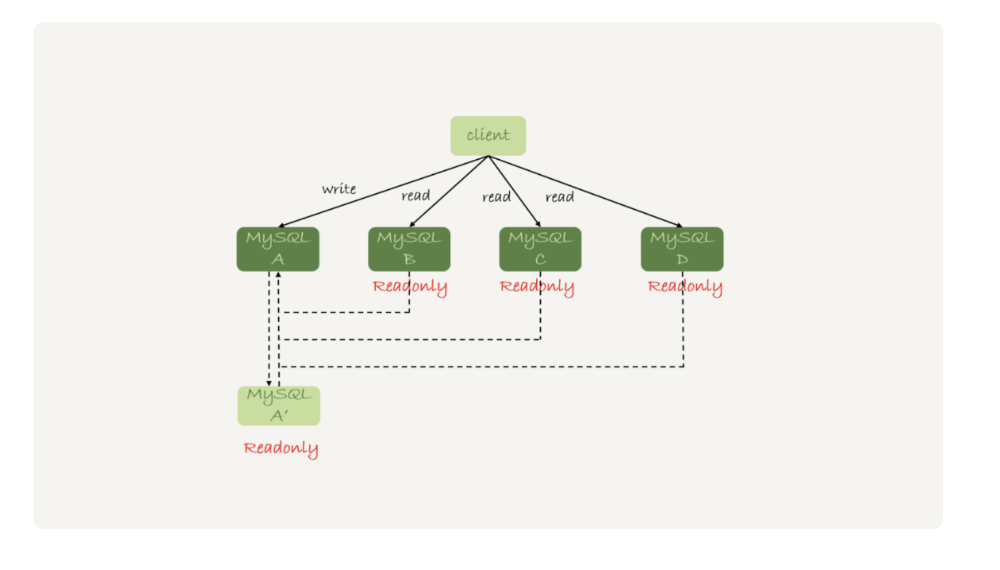

# mysql的读写分离有哪些坑

1. 首先说mysql的读写分离的两种架构
   1. 客户端直连架构
   2. 代理架构
   3. 对比两种架构优点和缺点：
      1. 对比与代理架构，客户端直连上性能会高一些。
      2. 对比与代理架构，会简单一些
      3. 对比与代理架构，当出现了主从切换的时候客户端是要有感知。
   4. 带有代理的架构
      1. 对客户端比较友好不需要关注后端细节，但是对代理维护要求高，而且需要专门的人员来维护，或者使用开源的。

**对于主从分离主要会出现过期读的现象（也就是当主库上更新，从库没有跟上就去读的情况）** 解决方案如下：

	1.  强制走主库
 	2.  sleep 方案
 	3.  判断主从延迟方案 (seconds_behind_master 这个来判断)
 	4.  配合semi-sync 方案 (半同步方案：
      1. 事务提交的时候，主库把 binlog 发给从库；
      2. 从库收到 binlog 以后，发回给主库一个 ack，表示收到了；
      3. 主库收到这个 ack 以后，才能给客户端返回“事务完成”的确认。)
 	5.  等主库位点方案
 	6.  等GTID方案

# 如何知道一个数据库有没有问题

1. select 1 判断 这个只能知道这个进程还在。

   innodb_thread_concurrency代表可以同时可以有多少个查询。并发连接和并发查询要分清楚。等待锁的线程是不计算在并发查询里面的。这样如果并发查询数量达到了。你select 1 以后还是不可以查询。

2. 查表判断 
   只要建立一张无用的表，只有一条数据，然后定期查询，**这个样就不会有并发数量过多导致不可用了。但是还有一个问题，就是**一旦binlog所在的磁盘使用率达到了百分之百，依然会有问题。 那么更新和commit事务的语句依然会被阻塞

3. 更新表判断

   可以加入对应的serverID然后库里面有多条数据，主库备库。这样就不会冲突了

4. 内部统计

# mysql 删除数据除了跑路还可以怎么办

1. 对于mysql的误删数据可以可以分为以下几类
   1. 使用delete 语句删除了部分数据
   2. 使用drop table 删除了数据表
   3. 使用drop database 删除了数据库
   4. 使用rm 删除了MySQL实例
2. 下面是解决方案：
   1. 对删除行Flash back可以帮助你，解析binlog 然后按照相反的方式执行一次可以了。方式是先要在备库上执行，然后同步到主库上。因为容易有二次破坏。sql_safe_updates 这个设置可以帮助你如果没有写where条件就会报错。
   2. 不小心删除了库和表； 全量的备份加增量的binlog来解决这个问题。 –database 可以应用binlog的时候指定数据库。恢复数据不是恢复所有的库，只是误删除的库就可以了。
   3. **延迟复制备库** 主从延迟的好作用。可以用于恢复数据
   4. rm实例就简单了，只要不是整个集群都删除了，主备切换增加新的从库就好了

# 什么？有一条语句无法kill掉

1. **kill query + 线程 id 和kill connection + 线程 id 第一个是杀死查询，第二个是杀死链接** 使用了 kill 命令，却没能断开这个连接。再执行 show processlist 命令，**看到这条语句的 Command 列显示的是 Killed。**
2. 收到了kill命令以后线程会做些什么呢？先修改当前链接的状态，然后给执行的线程发送信号。如果是killed状态说明是断开了链接，其实查询语句还是在执行的。 
3. 无法kill的语句一般就两种： 
   1. 线程还没有执行到 kill 的逻辑
   2. 执行的kill逻辑时间太长了。 

# join 到底有什么问题，不然使用呢？

1. 如果可以使用被驱动表的索引，就可以使用小表驱动大表，
2. 如果不可以使用被驱动表的索引，就应该尽量不使用join，可以用explain看看有没有 block nested loop的字样，有的话就不好使用。
3. 总的来讲应该小表驱动大表，要看对应的结果集小的才是小表，如果发现join的语句很慢可以尝试调大join_buffer来解决这个问题。

# mysql 什么时候会使用内部临时表

1. union 执行流程中需要去重，用到了临时表。
2. group by 用到了临时表
3. 内存临时表一般默认16M 如果操作这个大小会使用磁盘临时表。可以通过tmp_table_size 控制内存临时表的大小
4. group by的字段如果有索引可以省去临时表的。
5. 由此可知道，如果用到了二维表特性会优先使用临时表。

ps:

​	如果语句执行过程可以一边读数据，一边直接得到结果，就可以不使用额外的内存，否则会就会使用额外的内存。保存中间结果。 Join_buffer 是无需的数组，sort_buffer 是有序数组，临时表是二维表结构

​	优化建议 group by 如果没有排序要求就可以加上 order by null

​	尽量group by使用表上的索引，如果group by的数据不大尽量使用内存临时表。尽量避免磁盘临时表

​	如果实在太大可以通过 sql_big_result 来直接使用磁盘排序得到结果

# Innodb 好，那么还需要用 memory引擎吗？

1. 

# mysql 的自增主键是连续的吗？	

	1. mysql 的自增主键是mysql8.0以后才支持的持久化，之前是每次查库里当前最大的那个记录然后加一得到的。 如果插入发生了唯一键冲突或者其他的导致插入失败，都会导致自增不是连续的。
 	2. 如果事务回滚也是会导致自增不是连续的
 	3. 对于批量插入的语句自增主键的申请不是每次申请一个，而是第一个用完了，就申请两个，两个用完了 就申请4个每次都是上一次的两倍，如果用不完就浪费了。仍然会造成不连续

