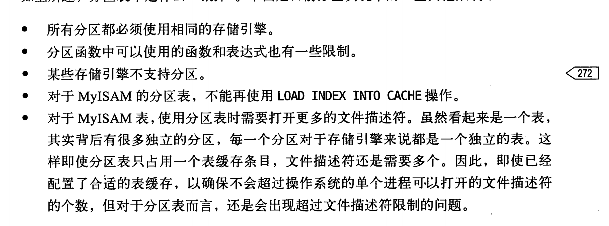

# mysql的高级特性

1. 分区表定义：**分区表是逻辑表，底层有多个物理子表组成**。实际上分区表就是一组底层表的句柄对象。这样也就**不存在全局索引**，而是每一个子表一个索引。多个# 分隔的表名。优化器在查询的时候会替我们过滤不需要的分区。

2. 适用场景：

   1. 表的最后部分是热点数据，其他的是历史数据。
   2. 分区表的数据更容易维护，可以删除整个分区
   3. 分区表可以存在于不同的物理设备上。
   4. 可以避免部分竞争
   5. 备份和恢复独立的分区

3. 分区表的限制：

   1. 最多1024个分区
   2. 分区表达式在5.5以前必须是整数，5.5以后有场景可以使用列分区
   3. 分区表无法使用外键
   4. 如果分区字段中包含主键或者唯一索引，那么主键和唯一索引都必须包含进来。

4. 所有的增删改查都是**先锁住所有的分区，然后判断是否可以过滤一部分分区。**存储引擎如果有行级锁，会分区层释放锁。

5. 什么情况下会有问题

   1. null会使得分区过滤无效，会扫描默认分区和正确的分区
   2. 分区和索引列不匹配，这样就需要每一个分区的索引。
   3. 选择分区的成本可能是很高的
   4. 打开所有底层分区表的成本可能是很高的
   5. 维护分区的成本可能也很高的

6. 

   

