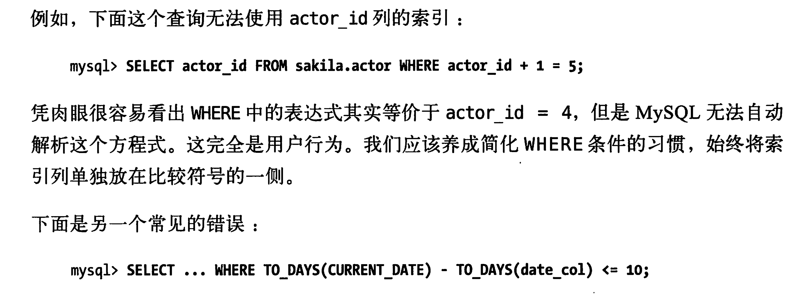
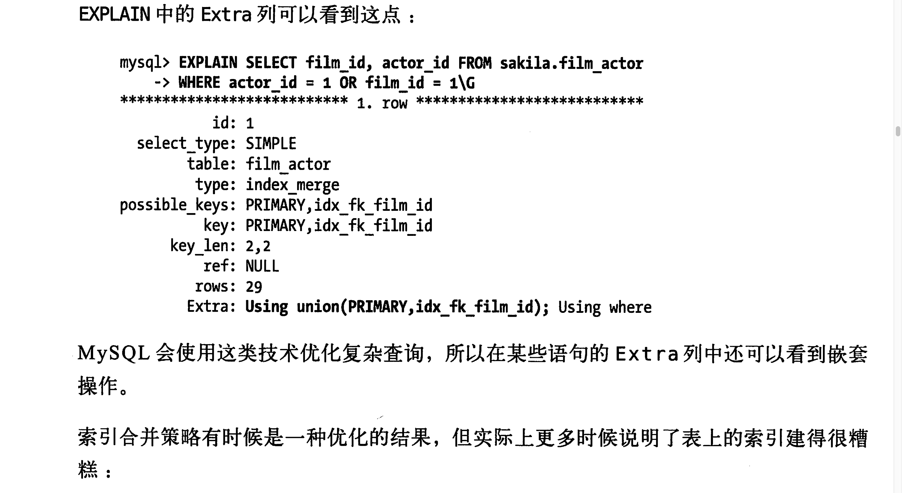
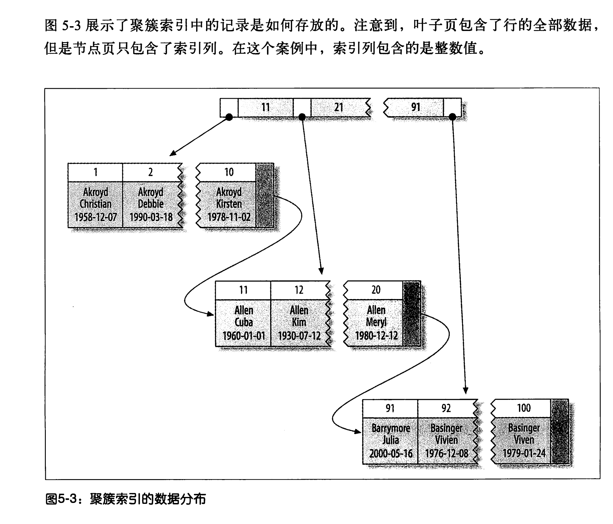
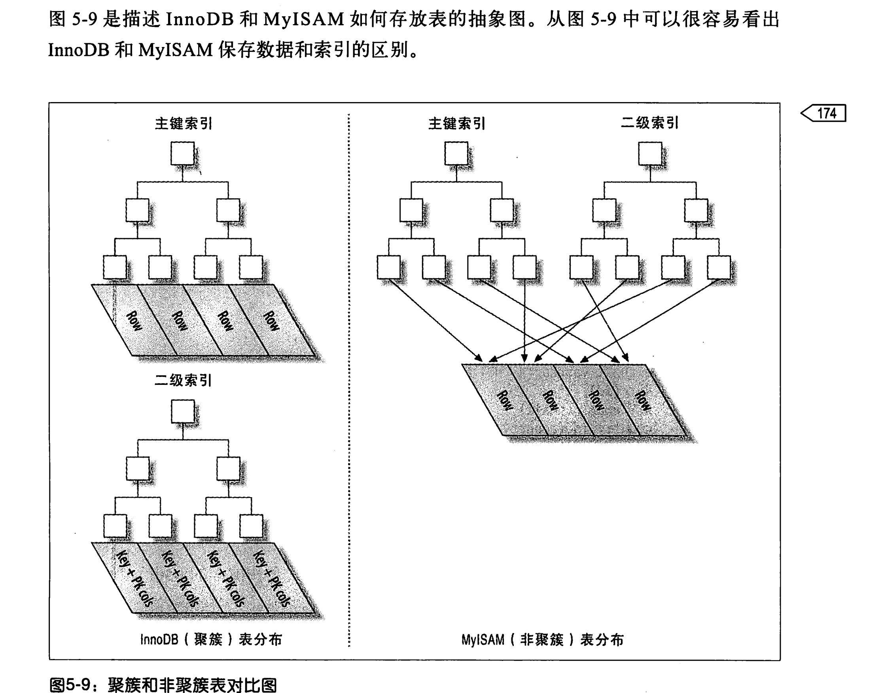
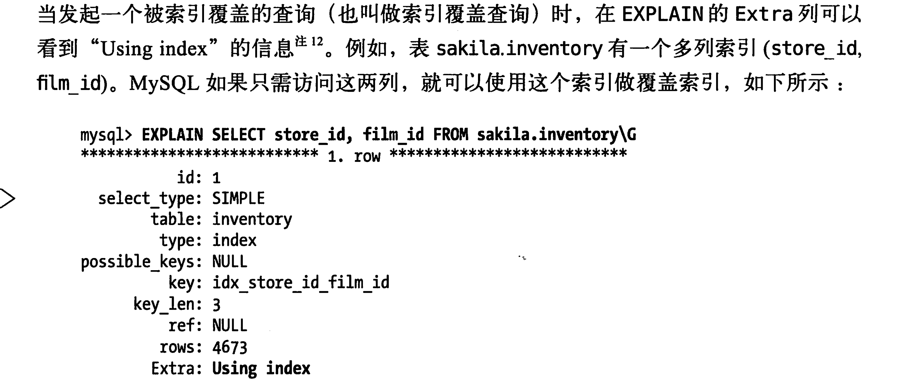
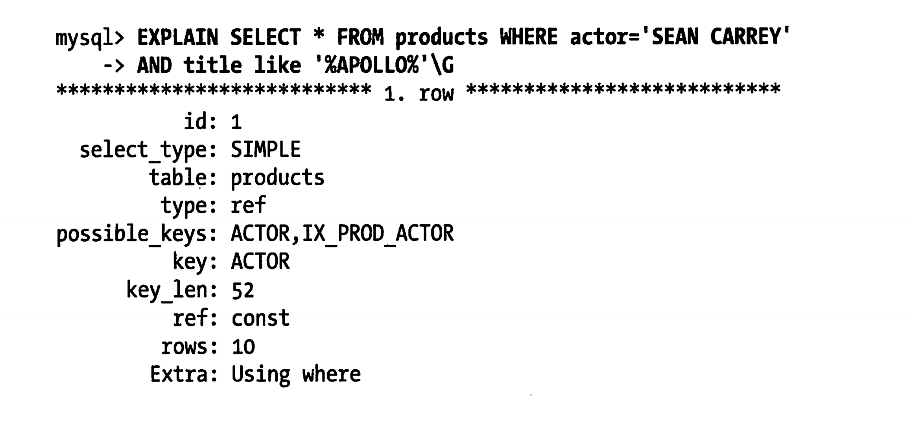

#  mysql索引相关

1. b+树索引
   - B-Tree 索引是默认的一种索引结构
   - innodb 是使用的b+树 NDB使用的T-Tree
   - b+树是顺序存储数据的所以很适合范围查找数据
   - b+树多列索引存储格式
   - 由存储格式可以知道一下查询是可以走索引的
     - 全值匹配 就是索引中所有的列
     - 匹配最左前缀
     - 匹配列前缀
     - 匹配范围值但是必须是前面的列
     - 精确匹配前面的列，范围匹配后面的列
     - 只访问索引的查询(覆盖索引)
   - 索引的一些限制
     - 不能跳过索引的部分列
     - 只能从左边开始
     - 如果有一列使用了范围查询右边的列就无法使用索引优化了
2. hash索引
   - 只有memory引擎显式支持了hash索引，也是memory的默认引擎。只有精确匹配所有列才有效。还支持了非唯一hash索引。使用链表来解决hash冲突的问题。
   - **hash索引的限制**
     - 只存储了hash值和对应的行指针，无法避免读取行数据
     - 无法排序
     - 不支持部分索引列查询
     - 只能等值查询 in 或者 = <>
     - 当冲突多的时候性能差
     - 冲突多的时候代价大
   - **NDB支持唯一hash索引**
   - innodb的自适应hash索引
     - 当innodb的某些索引使用的非常频繁的时候，会在b+tree索引之上再创建一个hash索引，完全自动的封闭的行为，不可以被用户控制。
   - 自定义hash 是单独一列作为另外一列的hash，使用hash这一列作为索引。
3. 空间数据索引
4. 全文索引 是关键字倒排索引
5. **分形树索引(后续了解)**

# 索引的优点

 1. 大大减少了服务器扫描的行数

 2. 索引可以帮助入去解决临时表和排序表

 3. 索引可以将随机I/O变成顺序I/O

    ps:索引并不一定总是好的解决方案，索引也会带来额外的工作，表比较小的时候是不如全表扫描更快的。

## 索引的高性能策略

 1. 独立的列(独立的列指的是索引列不能是表达式的一部分)同样的尽量把索引放到索引符号的一侧

 2. 前缀索引和索引选择性 索引的长度如果太大，尽量使用前缀索引。比如blob和text类型根本无法使用总长度来做索引的。但是这样就无法使用order by 和group by 更加无法使用索引覆盖扫描，后缀索引有的时候也很好用比如 邮箱，这个时候需要把数据翻转以后使用前缀来查询了

 3. 多列索引，在多个单列索引的情况下；
    当索引发生合并策略的时候说明需要一个多列索引来代替这个多列合并，多列索引的顺序很重要，如果不考虑排序和分组，选择性高的放前面会好一些

 4. 聚簇索引聚簇索引，是数据行存在于索引的叶子节点上
    聚簇索引需要一个索引列

    - 如果有主键，索引列就是主键
    - 如果没有主键，使用一个唯一非空索引代替
    - 如果没有非空唯一索引就隐式定义一个主键来代替

    **聚簇数据优点：**

    	- 相关的数据保存在一起
    	- 数据访问更快
    	- 使用覆盖索引扫描的时候可以直接使用索引的主键值

    **聚簇索引的缺点**

    	- 聚簇索引主要提升了密集I/O的性能，如果数据都在内存中优势就丢失了
    	- 插入速度严重依赖顺序
    	- 更新聚簇索引的代价会很大，因为需要移动行
    	- 有可能会在插入的时候需要页分裂
    	- 可能导致全表扫描变慢，尤其行稀疏的情况
    	- 二级索引(非聚簇索引)可能比想象的要大，因为二级索引包含了主键索引
    	- 二级索引需要查找两次

	5.  myisam和innodb的存储区别
     

	6.  innodb的表中按照主键顺序插入行：
     使用非自增趋势的插入导致的问题。

     - 写入的目标页可能已经刷到磁盘并移除了缓存，需要从新搜索，这样有大量的随机I/O
     - 写入顺序随机，有大量的页分裂
     - 页面变得十分稀疏，有大量的数据碎片

     主键顺序插入并非没有问题，比如并发插入的自增锁和热点数据问题。

	7.  **覆盖索引定义**： 如果一个索引覆盖了所有查询需要的字段，我们就成为覆盖索引这样就不需要回表了。
     索引覆盖的优点：

     - 索引条目一般远小于行数据，这样的数据放在缓存中会更好。如果需要回表，会有大量的I/O消耗在数据的拷贝上
     - 索引一定是按照列值存储的(最少单页如此)。比磁盘去读取随机读取行好很多了。
     - 一些存储引擎，比如myisam在内存中只缓存索引，这样就要求有系统调用才能得到数据
     - 如果多余innodb而言，**如果不需要回表，二级索引就从两次查询变成了一次**
       - hash索引是不可以成为覆盖索引的，因为没有值，只有hash值。
     - 
       **注意点： explain的 extra** using index 表示是索引覆盖
       如果索引只是覆盖了条件中的数据(where)，而且条件是false，不是覆盖了所有的查询，在5.5之前也是会回表的，尽管这一行还是会过滤掉
       
       

	8.  

