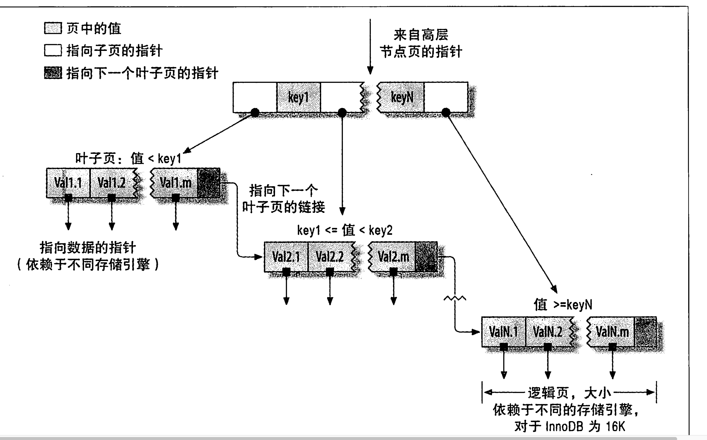
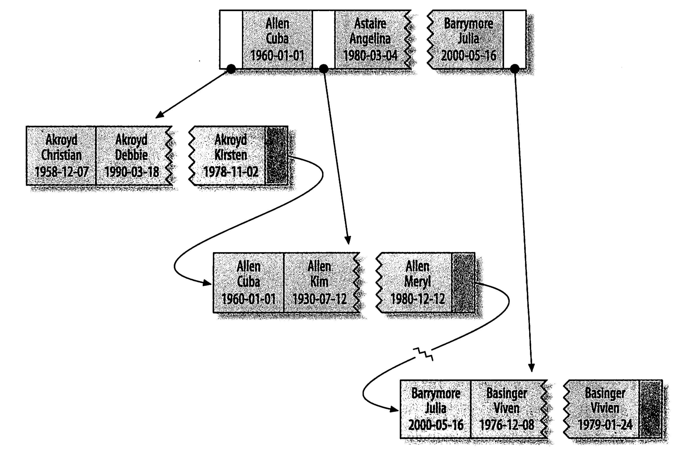
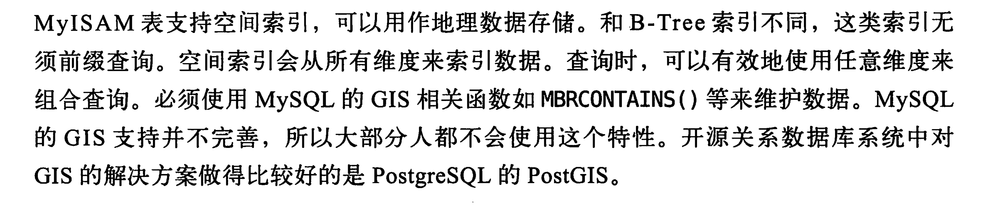

#  mysql索引相关

1. b+树索引
   - B-Tree 索引是默认的一种索引结构
   - innodb 是使用的b+树 NDB使用的T-Tree
   - b+树是顺序存储数据的所以很适合范围查找数据
   - b+树多列索引存储格式
   - 由存储格式可以知道一下查询是可以走索引的
     - 全值匹配 就是索引中所有的列
     - 匹配最左前缀
     - 匹配列前缀
     - 匹配范围值但是必须是前面的列
     - 精确匹配前面的列，范围匹配后面的列
     - 只访问索引的查询(覆盖索引)
   - 索引的一些限制
     - 不能跳过索引的部分列
     - 只能从左边开始
     - 如果有一列使用了范围查询右边的列就无法使用索引优化了
2. hash索引
   - 只有memory引擎显式支持了hash索引，也是memory的默认引擎。只有精确匹配所有列才有效。还支持了非唯一hash索引。使用链表来解决hash冲突的问题。
   - **hash索引的限制**
     - 只存储了hash值和对应的行指针，无法避免读取行数据
     - 无法排序
     - 不支持部分索引列查询
     - 只能等值查询 in 或者 = <>
     - 当冲突多的时候性能差
     - 冲突多的时候代价大
   - **NDB支持唯一hash索引**
   - innodb的自适应hash索引
     - 当innodb的某些索引使用的非常频繁的时候，会在b+tree索引之上再创建一个hash索引，完全自动的封闭的行为，不可以被用户控制。
   - 自定义hash 是单独一列作为另外一列的hash，使用hash这一列作为索引。
3. 空间数据索引
4. 全文索引 是关键字倒排索引
5. **分形树索引(后续了解)**

# 索引的优点

