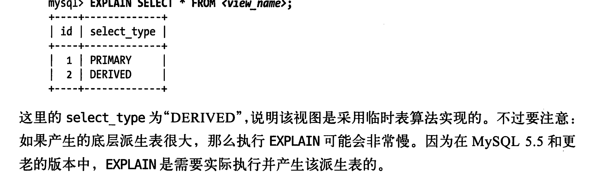

# mysql高级特性---视图

1. 视图本身是一个虚拟表，不存放任何数据

2. 表和视图的不同，视图不可以使用drop table，**不能对视图创建触发器**

3. 视图实现最简单的方法就是使用临时表。不过有很大的性能问题。 

4. 实现视图的更好的方法是重写视图的所有查询。这个查询和上面使用临时表是一样的。临时表相当于多包涵一个条件。就是第一次临时表的条件

5. mysql可以使用任何一种算法来实现：上述的方法是合并算法和临时表算法。

6. 只要视图表中的记录和原表中的记录无法实现一一对应就是使用临时表算法。来实习那视图。explain可以查看到视图相关的查询是临时表还是合并算法。

   

7. 视图的实现算法是视图的属性决定的和查询无关。

# 可更新视图

	1. 更新视图的查询也可以是一个关联语句。**但是有个限制被更新的列必须来自同一张表。临时表的查询是不是更新的**