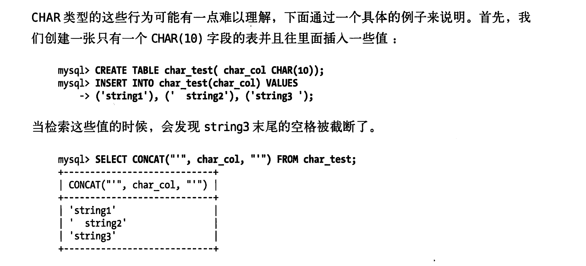

# **架构和数据类型优化**

1. 选择优化的数据类型有以下几条原则
   - 更小的通常更好
   - 简单就好，比如要尽量使用内建类型
   - 尽量要避免null
   - 具体的就是
     - 使用timeStamp 而不是 datetime前者空间更小，而且可以根据时区优化
     - 浮点数尽量不用存储和计算都不是很精确
     - char和varchar 后者是变长的，如果更新后放不下了Innodb是页分裂。myisam 是分多段存储。前者是定长的，**不足的部分是空格补足的**。所以如果在字符串结尾有空格，而且需要这个空格，就不要使用char类型
     - blob和text类型前者会二进制存储字符串后者是字符串存储字符串。这样就导致了，blob是没有字符集的而且没有排序规则。text就会有字符集和排序规则。**这里面的长字符串是不可以使用全部长度的字符做索引的。** PS：因为memory 引擎不支持 blob和text类型，所以如果查询使用这个类型就必须使用myisam的**磁盘临时表**，如果非要使用这个类型也可以使用subString 来截断这样就可以内存临时表了。可以使用explain 计划来查看是否使用了临时表(extra using temporary)这就表明使用临时表
     - 可以使用**枚举类型代替常用的字符串**，但是排序结果会按照定义对应的数字顺序来排序，而不是使用字符串的顺序。或者可以考虑按照指定的顺序定义好。**库里存的是具体的数字**。然后 .frm文件里面会有数字和字符串对应的关系。**filed()函数可以显示的指定排序，但是会导致mysql无法使用索引消除排序**。
     - 位数据类型
   - 