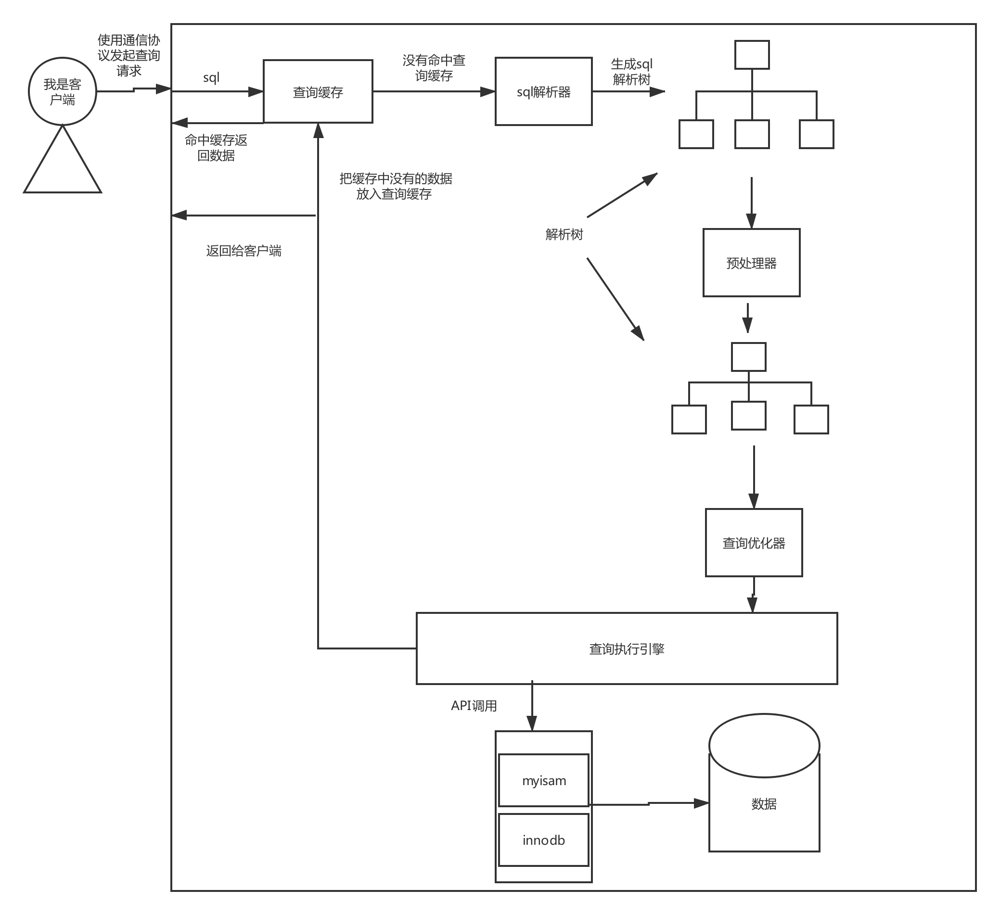

# 查询性能优化

1. 慢查询基础
   - 查询性能低的最根本原因是访问的数据太多了，**确认应用程序是否检索了超过需要的数据**，可能是多行，也可能是多列
   - 确认MySQL服务器是不是检索超过了需要的数据
2. 慢查询的典型案例 下面是应用程序的常见错误
   - 查询不需要的数据 比如有查所有行，取前10行
   - 多表关联关联返回全部列
   - 总是取出全部的列 
   - 重复查询相同的数据 比如一直查询头像这种固定信息
3. 衡量查询开销的三个指标
   - 扫描行数(这个能说明效率高不高一般 扫描行数和 返回行数壁纸在 10:1 到1:1也有可能非常大)
   - 响应时间 (分为 排队时间和服务时间)
   - 返回的行数
4. 扫描的行数和访问类型,explain执行的结果就是访问类型，**从全表扫描、索引扫描、范围扫描、唯一索引查询、常数引用不等(从慢到快)**MySQL一般能使用三种方式来使用where条件
   1. 在索引中使用where条件过滤不匹配的记录存储引擎层完成的
   2. 使用索引覆盖扫描来返回记录，直接从索引中过滤不需要的记录并返回命中的结果(extra using index)MySQL服务层完成的，但是不需要在回表了
   3. 从表中犯返回数据然后过滤数据，extra using where 这里是在MySQL服务层完成的，但是需要回表
5. 如果有扫描多行返回几行的数据需求可以这样优化
   - 使用覆盖索引
   - 改变库结构使用汇总表
   - 重写查询让MySQL能够用更优的方式来查询
6. 重构查询的方式
   1. 一个复杂查询还是多个简单查询
   2. 切分查询 (如果一个数据要删除或者更新太多数据一般是不好的)(比如分页),可能会占满资源，比如事务日志、耗尽系统资源 一般建议一次删除1W数据，而且最好 每次删除以后等待一会，分散压力
   3. 少使用关联查询,优势
      1. 使用数据库的缓存的可能性更大
      2. 把查询分解以后会减少锁的竞争
      3. 应用层做关联可以更好的扩展性对数据库友好
      4. 查询效率也会可能有升高
      5. 可能会减少冗余记录的查询
      6. 相当于使用了hash 关联而不是MySQL的嵌套关联
7. 查询执行的基础图中可以看出mysql的具体的基本查询步骤：
   - 客户端发送一条查询到服务器
   - 服务器先查询有没有命中查询缓存，如果命中了查询缓存就直接返回结果，如果没有命中查询缓存，就使用解析器和预处理器和优化器来生成查询计划
   - mysql服务器执行查询计划调用存储引擎来查询得到结果
   - 把结果返回客户端并且存到查询缓存中
8. mysql服务器和客户端的**通信协议 是半双工的**这也是我们为什么要通过max_allowed_packet来限制查询语句的大小了。半双工让我们无法做流量控制。
   - 查询状态（可以使用 show full processlist 查看）
     - Sleep 线程正在等待客户端发送请求，
     - query 线程正在查询或者在发送结果给客户端
     - locked在服务器层面线程在等待锁，存储引擎级别实现的锁是不在线程状态里面体现的
     - analyzeing and statistics 线程在搜集存储引擎统计信息，或者在生成查询计划
     - Copying to tmp table[on disk]线程在执行查询，并且将其结果都复制到临时表中，一般是group by 或者文件排序操作，union 操作。如果有on disk 说明在存放到磁盘上
     - sorting result 对结果集排序
     - Send data 这个表示多种情况发送数据、多个状态之间传送数据、生成结果集等
9. 查询缓存
      在解析一个sql语句之前如果查询缓存是开着的，mysql会先检查这个sql是否会命中查询缓存中的数据检查是一个**大小写敏感的hash查找实现的**。如果命中了查询缓存，会继续检查用的查询权限。没有其他的任何工作。
10. 查询优化处理：查询的下一步是把sql转化成一个查询计划，然后MySQL根据查询计划和存储引擎.
   1. 语法解析器和预处理
      1. 解析器：使用MySQL的语法解析和验证查询，这里会检查是否使用了错误的关键字或者是
      2. 预处理器： 根据一些MySQL规则来检查解析树是否合法检查数据表和数据列是否存在
   2. 查询优化器这一步的时候解析树已经是合法的了。优化器的作用是根据解析树给出成本最低的查询计划。
   3. 查询优化器会能处理的优化类型
      1. 重新定义表关联的顺序
      2. 将外链接变成內链接
      3. 使用等价变化规则
      4. 优化count() MIN()MAX()
      5. 预估并转化为常量表达式
      6. 覆盖索引扫描
      7. 子查询优化
      8. 提前终止查询
      9. 等值传播
      10. 列表in 转换会把in的列表 排序使用二分查找的方式
11. MySQL如何执行关联查询
12. mysql返回结果给客户端，mysql返回结果集是一个逐步增量的过程。两个好处：
    1. 客户端可以很快的获得结果
    2. 服务器不需要过多的内存
13. 
