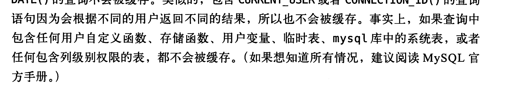
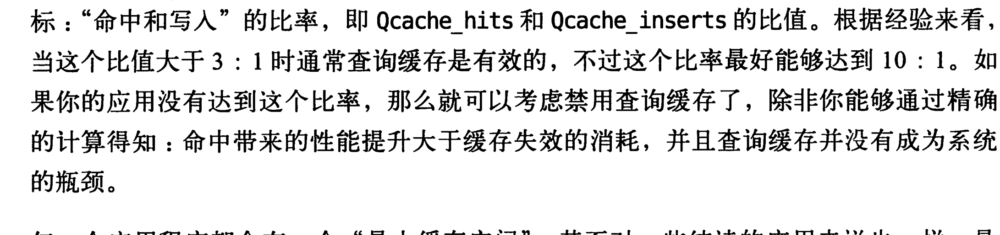
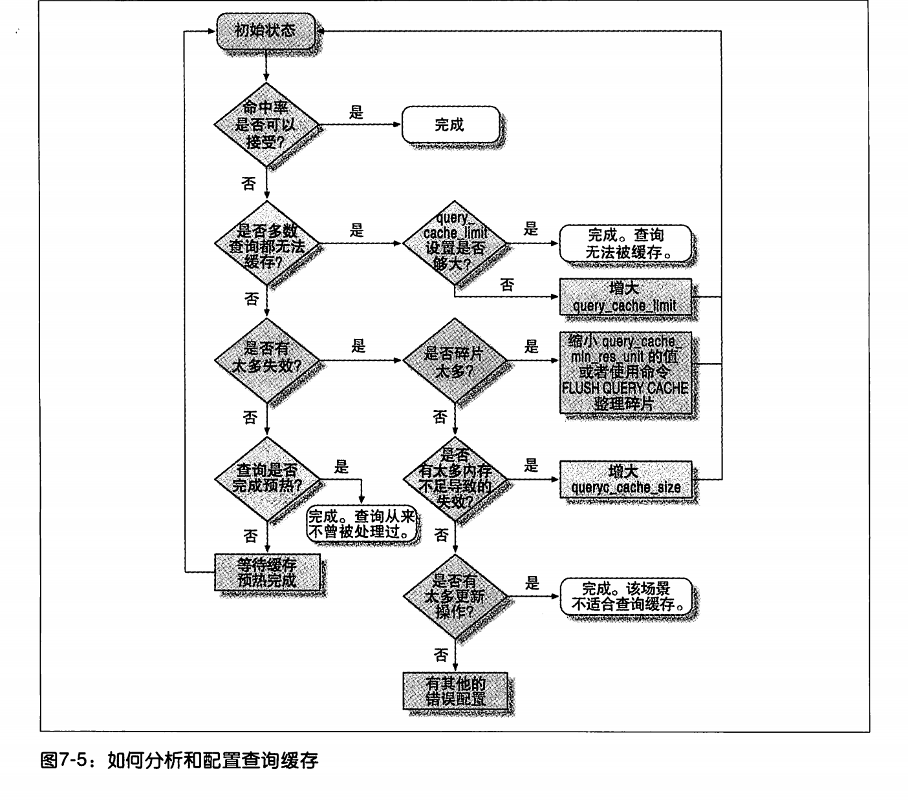

# **mysql**高级特性---查询缓存

1. 查询缓存的问题

   1. 查询缓存可能是服务的竞争资源。多核服务器还可能僵死

2. 缓存失效的情况是：如果涉及到的任何一张表，发生了变化，就失效所有和变换的表有关的所有查询缓存。主要是实现代价小。

3. mysql查询缓存如何命中：

   **缓存放在一张引用表中，通过一个hash值引用。(hash生成因素包含 数据库的协议涉及的表)，判断sql是否命中的时候，不会解析**，不会正规化或者参数查询语句**直接使用客户端发来的sql和其他信息。**任何的不同都会导致缓存无法命中。

   PS:当sql语句中有不确定的数据时不会缓存。比如NOW()
   如果查询中包含不确定的语句，在缓存中是不会找到结果的。

4. 查询缓存带来的消耗。

   1. 读查询开始以前必须先检查 是否命中缓存。
   2. 如果这个读查询可以被缓存，mysql查询完了 以后发现缓存里面没有回放入缓存这也是消耗
   3. 写操作会导致涉及该表的所有缓存都失效。

5. **mvcc 如果其他的时候修改了数据，会导致查询缓存失效**，但是这个事务提交以前是不会被其他的结果查询到的。

# 查询缓存如何使用内存

1. 查询缓存的内存管理是mysql自己做的。
2. 使用查询缓存也会有内存碎片的产生

# 查询缓存使用的场景

1. 一般情况是select 比update delete和 insert 要多很多才比较有效。
2. 查询没有命中的情况
   1. 查询语句无法被缓存。
   2. 缓存被失效了
   3. 第一次执行这个sql
3. 大多数被缓存了还是没有命中
   1. 查询缓存没有完全预热。查完了但是还没来得及缓存
   2. 查询语句从未执行过
   3. 失效操作太多了
4. 

# 查询缓存的配置

1. query_cache_type 是否开启查询缓存
2. query_cache_size 查询缓存使用的总内存空间，必须是1024的整数倍否则实际分配的和指定的会略有不同
3. query_cache_min_res_unit 查询缓存分配空间的最小单位
4. query_cache_limit mysql最大可以缓存的查询结果，如果查询结果大于这个值就不会被缓存，如果提前知道查询结果会超过这个值可以设置 sql_no_cache 来避免尝试放入缓存带来消耗
5. query_cache_wlock_invalidate 如果某个数据表被锁住是否仍然从查询结果中返回结果默认是false

ps: 通过配置正确的查询缓存的分配最小的空间单位可以减少碎片的使用

