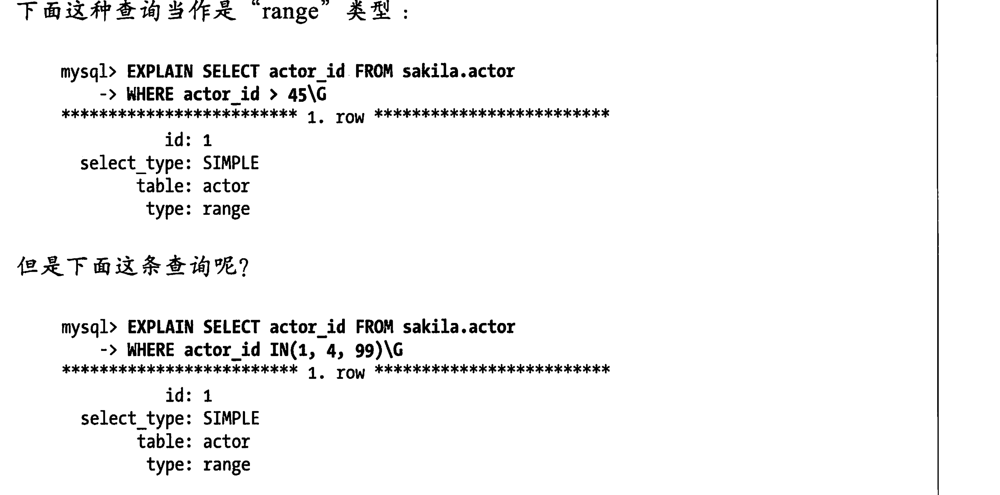

# 索引案例 优化

1. 支持多种过滤条件，把哪些经常用但是选择性不高的列作为 in 的列表组成前缀索引。主要原因是mysql使用了**一个索引进行范围查询就无法使用其他索引**或者使用索引后面的列**进行排序了**。
2. 避免多个范围条件（什么是范围查询首先explain这个计划里面是区分不出来的，因为type 都是range，但是范围查询和多个等值查询是不是一样的。对于范围查询上面有说无法使用其他索引或者后面的列了，但是多个等值查询没有这个限制。）
3. 优化排序当limit 非常大的时候会很慢，因为需要扫描大量会被抛弃的行，这种可以通过只查询主键走覆盖索引，然后再多个等值查询就可以了
4. 数据碎片有三种
   1. 行碎片(这种碎片指的是数据行被存储为多个地方的多个片段中，这样查询只能从索引中获取一条记录)
   2. 行间碎片（指的是逻辑上的行或者页在磁盘上不是顺序存储的。这样的碎片读全表扫描或者聚簇索引影响大，本来是可以磁盘上顺序扫描获取收益的的）
   3. 剩余空间碎片(数据页上有大量空余空间)**innodb 基本不会出现很小的行碎片** myisam 会出现这个三种碎片
5. 优化空间碎片是对性能有好的处的

