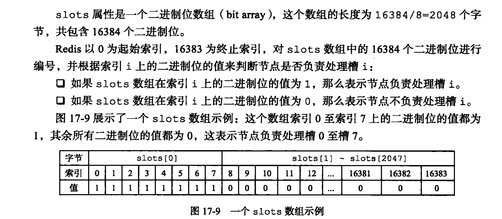
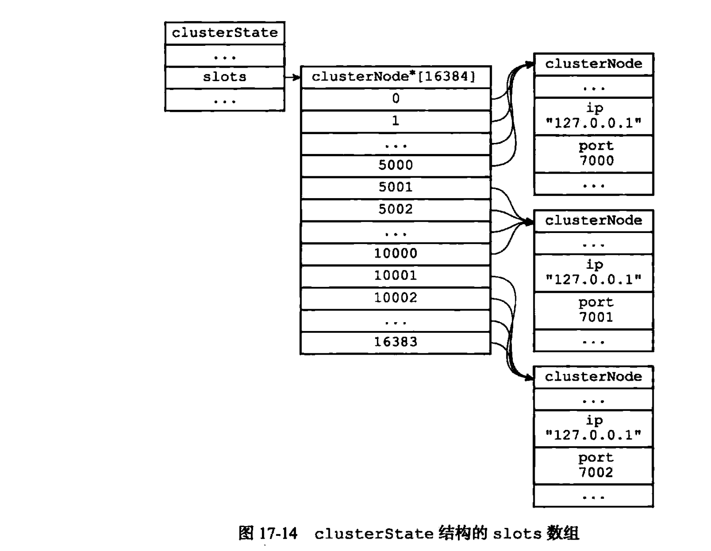
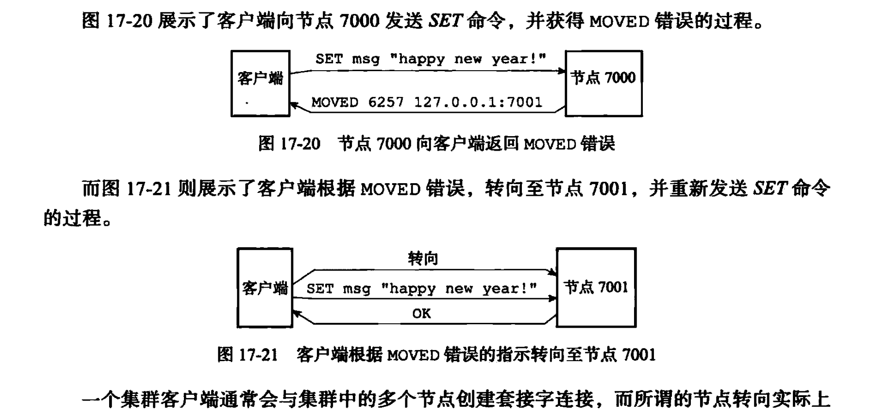
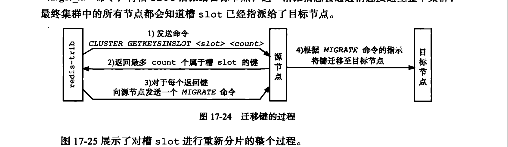
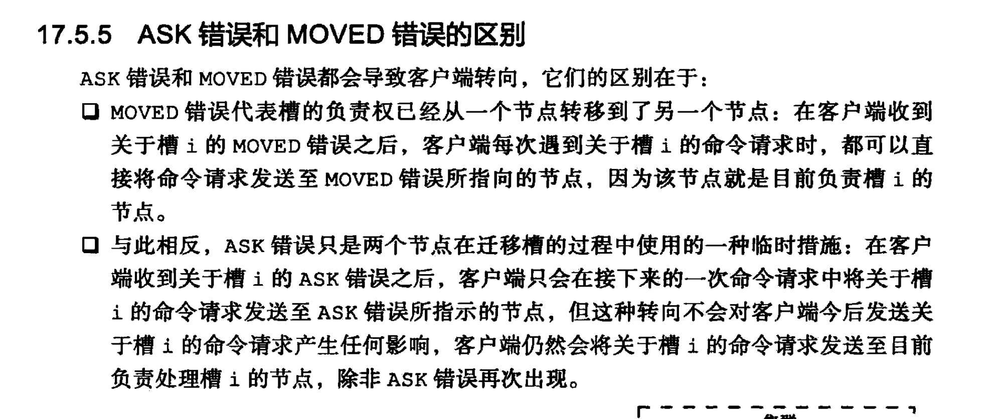

# Redis cluster 

​	Redis cluster ： 这是Redis提供的分布式数解决方案。哨兵这是提供了高可用的方案，并没没有解决我们的单机存储容量问题，也就是说如果我们用哨兵来存储数据的情况。我们需要自己的来实现不同的Redis实例存储不同数。自己实现分片**。集群通过分片来实现数据共享，并且提供了复制和故障转移等功能**

# 集群节点

	1. 一个Redis集群都是有多个实例组成。cluster meet可以发现新的节点。这样多个节点握手即可形成一个Redis集群了
 	2. cluster enable 可以决定集群模式的是否开启

# 槽指派

​	Redis通过分片来保存数据库中的键值对。集群被分成16384个槽。集群每一个节点可以处理0-16384个槽。当所有的槽都有节点处理的集群就是在线的。**如果有任意一个槽没有节点处理就是不在线的。**

节点会保存槽处理的信息。因为数组操作是o(1)的操作。所以把某一个槽指派给某个节点是非常迅速的。槽指派信息会在节点之间进行传播。slot数组代表槽的下标，同样会指向对应的cluster node。

**通过在cluster state 里面保存slots 数组解决了某个槽被指派给谁的高效处理方式。通过在cluster node 里面储存slots数组解决了，快速找到某个节点处理的槽信息，方便传播。**

# Redis集群命令执行过程

​	

命令属于哪一个槽计算方式：

​	CRC(16)&16383

计算命令是否该属于当前节点会用到上一节的cluster node里面的数组。然后如果发现不是就会用到cluster state 里面的slots 来判断该由哪一个节点来处理命令。

节点数据库的实现：cluster是只使用0号库。

槽和键的关系是跳表维护的。

# 重新分片

# ask错误

