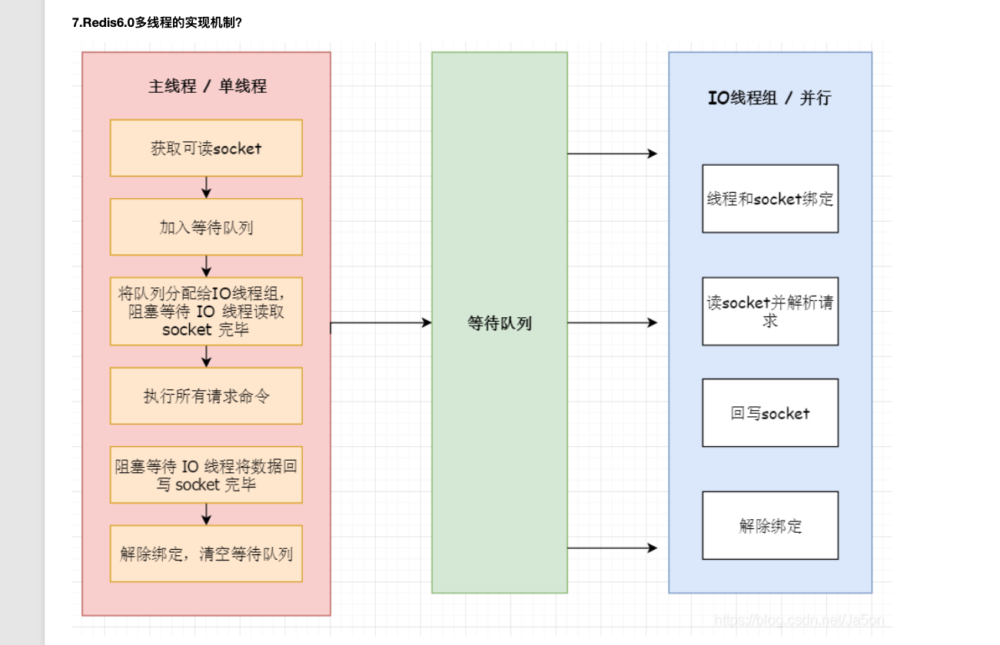

redis 6.0多线程处理

1. redis 4.0以后就不再是完全的单线程了，单线程的意思是对客户端处理从建立连接到返回数据都是一个线程在处理
2. 6.0 默认也是只使用主线程的，关闭了多线程选项是需要自己开启的
3. 开启多线程以后还是要设置线程数量，然后官方回答是超过8个就没有意义了
4. 

5. 6.0的redis并没有多线程的并发问题
6. todo memcached 的多线程模型
7. 