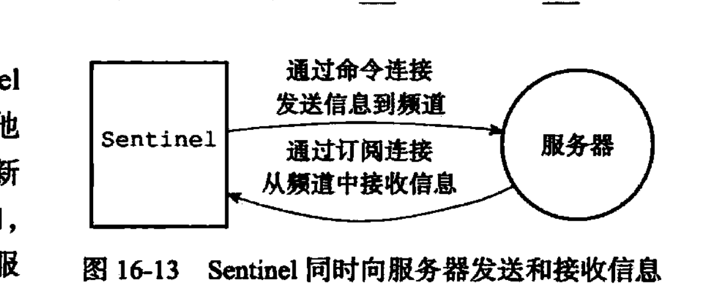

# redis--- 集群 哨兵模式

1. 哨兵只是一个运行在**特殊模式下的redis服务器**。它使用的命令模式和普通的服务器不同所以可以执行的命令就不同了。
2. 哨兵需要读取用户指定的master服务器的信息。然后启动以后需要和主服务器创建(异步)命令链接和订阅链接。ps：需要两个链接的原因是：redis的发布订阅功能中，被发送的消息是不会保存的，**所以哨兵了为不丢失这个频道的消息就需要订阅这个频道**。
   图中所示就是有两个链接的原因，因为命令也是通过频道发送到服务器的。
3. 哨兵通过向主服务器发送INFO命令来获取slave信息。**得到从服务器信息以后也会创建命令链接和订阅链接**。
4. **默认情况下，哨兵10s一次**向被监视的主服务器和从服务器发送INFO命令。如果正在发送**故障转移就改为1s**一次
5. 对于**监视同一个主服务器的哨兵来说,他们会2s每次的频率，通过向监听的主服务器发送消息来宣告自己的存在**。哨兵会保存其他的哨兵的信息（如果监控的是同一个主服务器）
6. 哨兵和哨兵之间只有命令链接没有订阅链接。
7. **哨兵会每秒一次的频率**来向其他的实例(主服务器，从服务器，哨兵)发送ping来确定其他实例的在线情况。如果在规定的时间内没有得到回复就会认为是主观下线。(规定的时间对于每一个哨兵可能是不一样的)。当一个哨兵认为主服务器主观下线的时候，会去询问其他的哨兵，看他们是否同意这个服务器进入主观下线状态。如果达到了设置的数量以后就发起故障转移操作。
8. 是在一个主服务器是客观下线以后，发起的哨兵选举，得到一个首领哨兵来发起故障转移。只有领头的哨兵才可以发起故障转移操作。
9. 新的master是怎么选举出来的：
   1. 删除所有的下线或者断开状态的服务器。
   2. 删除最近5s内没有回复过领头的哨兵的info命令的。
   3. 删除所有和下线主服务器链接断开时间超过设定时间的10倍的。
   4. 根据服务器的优先级来选举，如果有多个优先级一样的，对比复制偏移量，如果偏移量一样的就选择运行ID较小的。
10. 哨兵的选举时通过ratf一致性算法来选举的。
11. 哨兵不提供分片只是提供了高可用的redis集群而已。